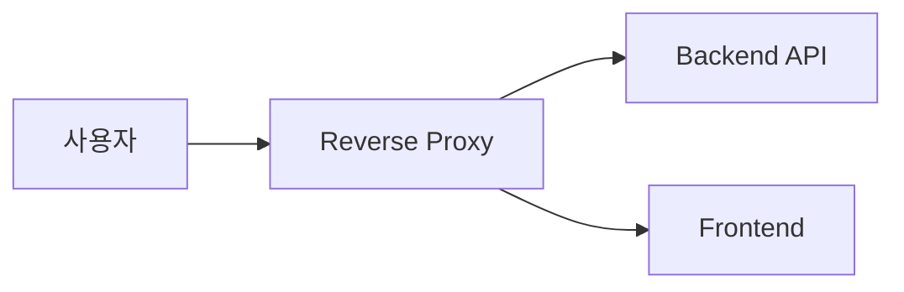

# Reverse Proxy 기본 개념

[인프라 결정 기록으로 돌아가기](README.md)

## Proxy란?

Proxy는 통신하는 두 대상 사이에서 요청과 응답을 중계하는 구성 요소다. Forward Proxy는 사용자를 대신해 외부 서버에 접근하고, Reverse Proxy는 서버들을 대신해 사용자 요청을 받는다.

## Reverse Proxy의 역할

- 하나의 도메인과 포트에서 요청을 받는다.
- 경로나 도메인에 따라 다른 내부 서비스로 전달한다.
- TLS 연결을 처리해 내부 애플리케이션의 HTTPS 부담을 줄일 수 있다.
- HTTP 요청을 HTTPS로 전환할 수 있다.
- 요청 크기, 연결 시간과 속도 제한을 적용할 수 있다.
- 접근 로그를 기록하고 응답을 압축하거나 캐시할 수 있다.
- 여러 서버가 있으면 요청을 분산할 수 있다.

## 기본 용어

- **Upstream**: Reverse Proxy가 요청을 전달하는 내부 애플리케이션 서버
- **Routing**: 호스트나 경로에 따라 요청 대상을 정하는 규칙
- **TLS termination**: 암호화 연결을 Proxy에서 해제하고 내부 요청으로 전달하는 방식
- **Load balancing**: 여러 서버에 요청을 분배하는 기능
- **Sticky session**: 같은 사용자의 요청을 계속 같은 서버로 보내는 방식
- **Timeout**: 일정 시간 안에 연결이나 응답이 끝나지 않으면 중단하는 설정
- **Rate limiting**: 일정 시간 동안 허용할 요청 수를 제한하는 기능

Reverse Proxy는 인증서 자체가 아니다. HTTPS를 제공하려면 Proxy가 사용할 TLS 인증서 또는 앞단에서 TLS를 처리하는 별도 서비스가 필요하다.

## 주요 Reverse Proxy

### Nginx

Nginx는 정적 파일 웹 서버, Reverse Proxy와 로드밸런서 기능을 제공하는 소프트웨어다. 설정 파일에 요청을 받을 주소, 경로별 Upstream, 헤더와 TLS 동작을 선언한다.

### Caddy

Caddy는 웹 서버와 Reverse Proxy 기능을 제공하는 오픈소스 소프트웨어다. Caddyfile이라는 설정 형식을 사용하며 공개 도메인의 인증서 발급과 갱신을 자동화하는 Automatic HTTPS 기능을 포함한다.

### Traefik

Traefik은 컨테이너와 동적 인프라를 대상으로 설계된 Reverse Proxy다. Docker, Kubernetes 같은 Provider에서 실행 중인 서비스 정보를 읽고 라우팅 구성을 동적으로 갱신할 수 있다.

### AWS Application Load Balancer

ALB는 HTTP와 HTTPS 요청을 여러 대상에 전달하는 AWS 관리형 Layer 7 로드밸런서다. Listener가 연결을 받고 Rule이 요청 조건을 판단해 Target Group의 EC2, IP 또는 다른 지원 대상으로 전달한다.
