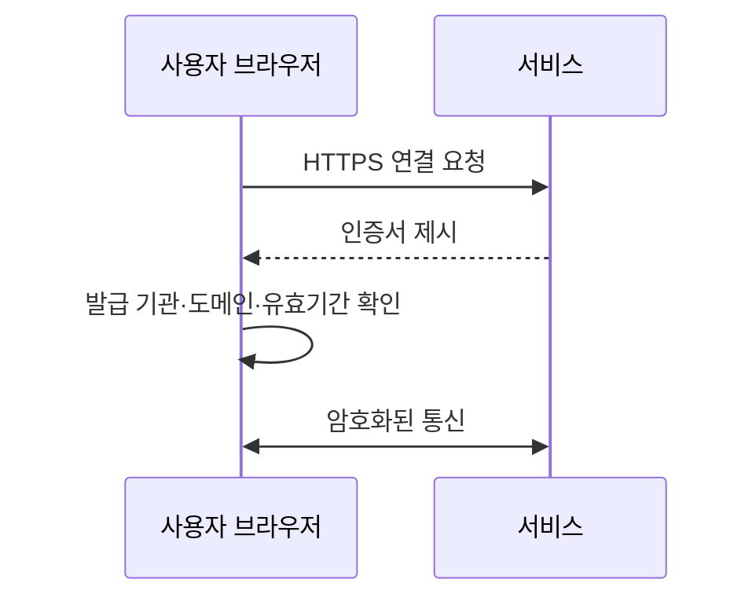

# HTTPS와 TLS 인증서 기본 개념

[인프라 결정 기록으로 돌아가기](README.md)

## HTTPS란?

HTTPS는 HTTP 통신을 TLS로 암호화하는 방식이다. 네트워크 중간에서 요청과 응답이 노출되거나 변조되는 위험을 줄이고, 사용자가 올바른 서버에 접속했는지 확인하게 한다.

## TLS 인증서란?

TLS 인증서는 특정 공개 키와 도메인의 관계를 인증기관(CA)이 확인한 전자 문서다. 서버는 연결 과정에서 인증서를 제시하고 브라우저는 발급 기관, 도메인과 유효기간을 검사한다.

## 기본 용어

- **CA(Certificate Authority)**: 인증서를 발급하고 서명하는 신뢰 기관
- **Public key**: 외부에 공개할 수 있는 암호화 키
- **Private key**: 서버만 보관해야 하는 비밀 키
- **CSR**: 인증서 발급에 필요한 정보를 담아 CA에 보내는 요청
- **Domain validation**: 요청자가 도메인을 통제하는지 확인하는 절차
- **Certificate chain**: 서버 인증서부터 신뢰할 수 있는 루트 CA까지 이어지는 서명 관계
- **Renewal**: 만료 전에 새 인증서를 발급하고 교체하는 작업
- **ACME**: 인증서 발급과 갱신을 자동화하는 표준 프로토콜

인증서가 만료되거나 도메인 이름이 일치하지 않으면 브라우저에 보안 경고가 표시된다. 인증서 자동 갱신을 구성했더라도 실패를 감지하는 모니터링이 필요하다.

외부 인터넷이 차단된 조직 내부 서비스는 공개 CA 대신 조직이 운영하는 사내 CA와 내부 신뢰 체계를 사용할 수 있다.

## 주요 인증서 발급·관리 방식

### Let's Encrypt

Let's Encrypt는 도메인 소유를 자동으로 검증하고 공개 TLS 인증서를 무료로 발급하는 인증기관이다. ACME 클라이언트가 HTTP 또는 DNS 검증을 수행하고 만료 전에 인증서를 다시 발급할 수 있다.

### Certbot

Certbot은 ACME 프로토콜을 사용해 Let's Encrypt 인증서 발급과 갱신을 자동화하는 클라이언트다. 웹 서버 설정을 직접 변경하거나 인증서 파일만 발급하는 방식으로 사용할 수 있다.

### AWS Certificate Manager

ACM은 AWS가 TLS 인증서 발급과 갱신을 관리하는 서비스다. 발급한 인증서는 Application Load Balancer, CloudFront 등 지원되는 AWS 서비스에 연결한다. 인증서가 사용되는 위치와 유형에 따라 내보내기 가능 여부와 적용 방식이 다르다.

### 상용 인증기관의 유료 인증서

상용 CA가 계약과 검증 절차를 통해 발급하는 인증서다. 도메인 소유만 확인하는 인증서 외에 조직 정보를 확인하는 상품, 기술 지원과 보증 조건 등이 포함될 수 있다.
