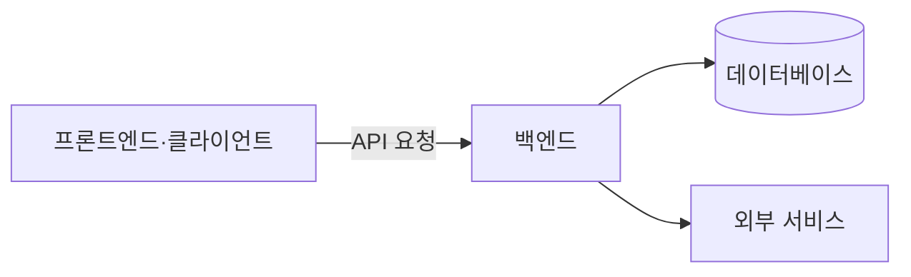

# 백엔드 기본 개념

[인프라 결정 기록으로 돌아가기](README.md)

## 백엔드란?

백엔드는 사용자 화면이나 다른 시스템의 요청을 받아 비즈니스 규칙을 수행하고 데이터베이스와 외부 서비스에 접근하는 서버 애플리케이션이다.

## 주요 역할

- 사용자 인증과 접근 권한 확인
- 요청 데이터 검증
- 비즈니스 규칙 실행
- 데이터베이스 조회와 변경
- 외부 API 또는 GPU 서버 호출
- 오류 처리와 로그 기록
- API 응답 생성

## 기본 용어

- **API**: 프로그램끼리 기능과 데이터를 주고받는 규칙
- **Endpoint**: 특정 API 기능에 접근하는 URL과 HTTP Method의 조합
- **REST**: HTTP의 자원과 Method를 이용해 API를 구성하는 방식
- **Request/Response**: 클라이언트가 보내는 요청과 서버가 돌려주는 응답
- **Serialization**: 객체를 JSON 같은 전송 형식으로 변환하는 과정
- **Validation**: 입력값이 형식과 규칙에 맞는지 검사하는 과정
- **Middleware**: 요청 처리 전후에 공통 로직을 수행하는 계층
- **Dependency injection**: 객체가 필요한 의존 대상을 외부에서 전달받는 설계 방식
- **Framework**: 라우팅, 검증과 DB 연동 같은 서버 개발의 공통 기능을 제공하는 도구

백엔드 프레임워크는 언어 실행 속도만으로 선택하지 않는다. 팀 경험, 데이터 처리 방식, 라이브러리, 테스트 가능성과 장기 유지보수를 함께 고려해야 한다.

## 주요 백엔드 프레임워크

### Spring Boot

Spring Boot는 Java 또는 Kotlin으로 Spring 기반 서버 애플리케이션을 구성하는 프레임워크다. 내장 웹 서버, 설정 자동화와 의존성 구성을 제공하며 Spring Security, Spring Data 등 Spring 생태계와 함께 사용한다.

### FastAPI

FastAPI는 Python 타입 힌트를 기반으로 API 요청과 응답을 검증하는 웹 프레임워크다. ASGI 서버에서 실행되며 OpenAPI 명세와 대화형 API 문서를 자동으로 생성할 수 있다.

### NestJS

NestJS는 Node.js와 TypeScript 기반 서버 프레임워크다. Module, Controller, Provider와 의존성 주입 구조를 제공하며 내부적으로 Express 또는 Fastify 같은 HTTP 플랫폼을 사용할 수 있다.
