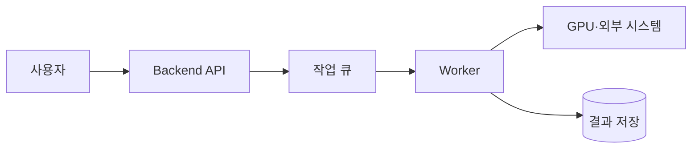

# 비동기 작업 기본 개념

[인프라 결정 기록으로 돌아가기](README.md)

## 동기와 비동기 처리

동기 처리에서는 요청을 보낸 사용자가 작업이 끝날 때까지 응답을 기다린다. 비동기 처리에서는 서버가 작업 접수를 먼저 알리고 실제 처리는 별도 Worker가 나중에 수행한다.

AI 추론, 대용량 파일 처리, 이메일 발송과 외부 API 호출처럼 오래 걸리거나 실패 후 재시도가 필요한 작업에 비동기 구조를 사용할 수 있다.

## 기본 구성 요소

- **Producer**: 처리할 메시지나 작업을 생성해 큐에 넣는 애플리케이션
- **Queue**: 아직 처리하지 않은 작업을 보관하는 공간
- **Consumer/Worker**: 큐에서 작업을 가져와 실행하는 프로세스
- **Acknowledgement**: 작업 처리가 끝났음을 큐에 알리는 응답
- **Retry**: 일시적 실패가 발생한 작업을 다시 시도하는 정책
- **Dead-letter queue**: 반복해서 실패한 메시지를 분리해 보관하는 큐
- **Visibility timeout**: 한 Worker가 처리 중인 메시지를 다른 Worker에게 잠시 숨기는 시간
- **Backpressure**: 생산 속도가 처리 속도보다 빠를 때 시스템 과부하를 제어하는 방법

## 중복 처리와 멱등성

네트워크 오류나 Worker 장애로 같은 작업이 두 번 전달될 수 있다. 멱등성은 같은 작업을 여러 번 수행해도 결과가 한 번 수행한 것과 같게 만드는 성질이다. 고유 작업 ID, DB 제약조건과 처리 상태 기록 등을 이용해 중복 결과를 방지할 수 있다.

비동기 처리를 도입하면 작업 상태 조회, 오류 표시, 재시도 한도와 장기 실행 작업의 취소 정책도 함께 설계해야 한다.

## 주요 처리 방식과 큐

### 별도 메시지 큐 없는 처리

HTTP 요청을 받은 Backend가 작업을 바로 실행하거나 같은 프로세스의 내부 작업 실행기에 넘기는 방식이다. 외부 큐 서비스가 없으며 작업 상태와 재시도를 애플리케이션 프로세스 및 DB 등의 수단으로 직접 관리한다.

### Amazon SQS

SQS(Simple Queue Service)는 Producer가 보낸 메시지를 AWS가 보관하고 Consumer가 Polling으로 가져가는 관리형 메시지 큐다. 처리 완료 후 메시지를 삭제하며 Visibility Timeout, 재시도와 Dead-letter queue 구성을 제공한다.

### Redis 기반 작업 큐

Redis의 List, Sorted Set, Stream 같은 자료 구조와 언어별 Queue 라이브러리를 이용해 작업을 전달하는 방식이다. 라이브러리가 작업 직렬화, 예약 실행, 재시도와 Worker 관리를 제공할 수 있으며 Redis 서버가 메시지 상태를 저장한다.

### RabbitMQ

RabbitMQ는 Producer가 보낸 메시지를 Exchange와 Binding 규칙에 따라 Queue로 전달하는 Message Broker다. Consumer Acknowledgement, Publisher Confirm, 재전달과 Dead-letter Exchange 등을 구성할 수 있으며 Broker 서버의 저장 공간, Cluster와 업데이트를 운영 주체가 관리한다.

### Apache Kafka

Kafka는 이벤트를 Topic의 Partition에 순서대로 추가하고 정해진 보존 기간 동안 유지하는 분산 Event Streaming 플랫폼이다. Consumer는 Offset으로 읽은 위치를 관리하고 이전 Offset으로 돌아가 이벤트를 다시 처리할 수 있다. 여러 독립 Consumer가 같은 이벤트 흐름을 각자의 목적으로 읽을 수 있다.

### 작업 큐와 Event Stream의 차이

전통적인 작업 큐는 하나의 작업을 Consumer 중 하나가 처리하고 완료 후 제거하는 흐름에 초점을 둔다. Event Stream은 이벤트를 일정 기간 보존하면서 여러 Consumer가 각자의 읽기 위치로 반복 처리하는 흐름에 초점을 둔다. 실제 제품은 두 기능을 일부 함께 제공할 수 있지만 중심 사용 방식이 다르다.
