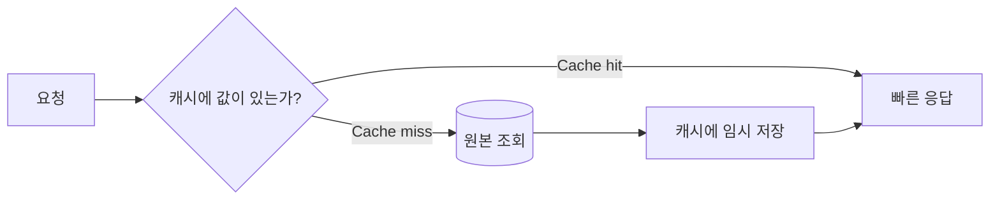

# 캐시 기본 개념

[인프라 결정 기록으로 돌아가기](README.md)

## 캐시란?

캐시는 자주 조회하거나 계산 비용이 큰 결과를 더 빠른 저장 공간에 임시로 보관하는 방식이다. 같은 요청에서 데이터베이스 조회나 계산을 반복하지 않아 응답 시간을 줄이고 원본 시스템의 부하를 낮출 수 있다.

## 기본 용어

- **Cache hit**: 필요한 값이 캐시에 있어 원본을 조회하지 않는 상태
- **Cache miss**: 값이 없어 원본에서 가져와야 하는 상태
- **Hit ratio**: 전체 조회 중 Cache hit이 발생한 비율
- **TTL(Time To Live)**: 캐시 값이 자동으로 만료되기까지의 시간
- **Eviction**: 공간이 부족하거나 정책에 따라 캐시 값을 제거하는 동작
- **Cache invalidation**: 원본 변경에 맞춰 오래된 캐시를 삭제하거나 갱신하는 작업
- **Cache stampede**: 인기 값이 동시에 만료되어 많은 요청이 원본으로 몰리는 현상

## 대표적인 캐시 패턴

- **Cache-aside**: 애플리케이션이 먼저 캐시를 확인하고 없으면 원본에서 읽어 캐시에 저장한다.
- **Write-through**: 데이터를 변경할 때 캐시와 원본을 함께 갱신한다.
- **Write-behind**: 캐시에 먼저 기록하고 원본에는 나중에 반영한다.

캐시는 원본 데이터가 아니어야 한다. 캐시가 중단되거나 모든 값이 사라져도 원본에서 값을 다시 만들 수 있어야 한다. 실제 병목을 측정하지 않고 캐시를 추가하면 데이터 불일치와 장애 지점만 늘어날 수 있다.

## 주요 캐시 구성

### 별도 캐시 없음

애플리케이션이 요청마다 DB나 원본 시스템에서 데이터를 읽고 필요한 계산을 수행하는 구조다. 프로세스 내부의 짧은 메모이제이션을 제외하면 여러 요청이 공유하는 별도 캐시 서버가 없다.

### Redis

Redis는 문자열, Hash, List, Set와 Sorted Set 같은 자료 구조를 메모리에서 처리하는 키-값 데이터 저장소다. 키별 TTL을 설정할 수 있어 공유 캐시, 임시 상태와 세션 등에 사용된다. 설정에 따라 디스크 영속성을 사용할 수도 있다.

### Amazon ElastiCache

ElastiCache는 AWS가 캐시 클러스터의 생성, 노드 교체, 모니터링과 일부 운영을 관리하는 서비스다. 지원하는 캐시 엔진을 선택해 VPC 내부 Endpoint로 연결하며 노드 수, 복제와 장애 조치 구성을 지정한다.
