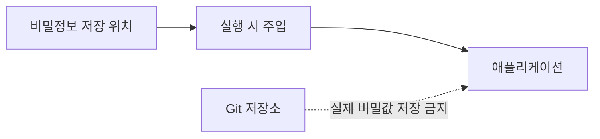

# 비밀정보 관리 기본 개념

[인프라 결정 기록으로 돌아가기](README.md)

## 비밀정보란?

비밀정보(Secret)는 유출되면 시스템이나 데이터에 접근할 수 있는 민감한 값이다.

- 데이터베이스 비밀번호
- 외부 서비스 API 키
- 접근 토큰
- 암호화 키
- TLS 인증서의 Private key

일반 환경 설정과 비밀정보는 구분해야 한다. 포트 번호나 로그 레벨은 공개되어도 큰 문제가 없지만 인증 값은 접근을 엄격하게 제한해야 한다.

## 기본 원칙

- 실제 비밀값을 소스 코드, Git 저장소와 Docker 이미지에 넣지 않는다.
- 개발, 검증과 운영 환경의 비밀을 분리한다.
- 사람과 서비스에 필요한 비밀만 읽을 수 있는 최소 권한을 준다.
- CI 로그, 오류 메시지와 명령 기록에 비밀을 출력하지 않는다.
- 비밀의 소유자, 용도와 교체 주기를 관리한다.
- 유출이 의심되면 즉시 폐기하고 새 값으로 교체한다.

## 기본 용어

- **Secret injection**: 실행 시 환경변수나 파일 등의 형태로 비밀을 전달하는 과정
- **Encryption at rest**: 저장된 비밀을 암호화하는 것
- **Encryption in transit**: 전송 중인 비밀을 TLS 등으로 암호화하는 것
- **Rotation**: 기존 비밀을 새 값으로 주기적으로 교체하는 작업
- **Least privilege**: 작업에 꼭 필요한 최소 권한만 부여하는 원칙
- **Audit log**: 누가 언제 비밀에 접근하거나 변경했는지 남긴 기록

이미 Git에 커밋한 비밀은 파일에서 삭제하는 것만으로 안전해지지 않는다. Git 이력이나 복제본에 남아 있을 수 있으므로 해당 값을 폐기하고 재발급해야 한다.

## 주요 비밀정보 저장 방식

### `.env` 파일

`KEY=VALUE` 형태의 환경변수들을 파일에 기록하는 관례다. Docker Compose와 여러 애플리케이션 도구가 이 파일을 읽어 프로세스 환경변수로 전달할 수 있다. 파일 자체의 암호화와 접근 통제 기능은 없으므로 운영체제 권한과 별도 전달 절차가 필요하다.

### AWS Systems Manager Parameter Store

Parameter Store는 문자열 설정값을 계층형 이름으로 저장하는 AWS 서비스다. 일반 문자열과 암호화된 SecureString을 지원하며 IAM 정책으로 읽기·쓰기 권한을 제한한다.

### AWS Secrets Manager

Secrets Manager는 비밀번호와 API 키 같은 비밀을 버전과 함께 저장하는 AWS 서비스다. IAM으로 접근을 통제하고 API로 값을 조회하며 일부 시스템과 연결해 비밀 교체 Workflow를 구성할 수 있다.
