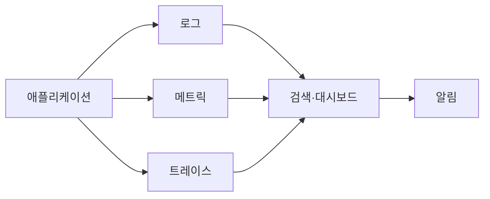

# 로그·모니터링 기본 개념

[인프라 결정 기록으로 돌아가기](README.md)

## 시스템을 관찰하는 세 가지 신호

- **로그(Logs)**: 애플리케이션과 서버에서 발생한 사건을 시간순으로 기록한 데이터
- **메트릭(Metrics)**: CPU 사용률, 요청 수와 오류율처럼 시간에 따라 측정한 숫자
- **트레이스(Traces)**: 하나의 요청이 여러 서비스와 작업을 거치는 전체 흐름

Observability는 이 신호들을 이용해 외부에서 시스템 내부 상태를 이해할 수 있는 정도를 의미한다. 모니터링은 알려진 장애 조건을 감시하는 활동이고, Observability는 예상하지 못한 문제의 원인까지 조사할 수 있게 만드는 더 넓은 개념이다.

## 기본 용어

- **Dashboard**: 주요 상태와 추세를 시각적으로 모아 보여주는 화면
- **Alert**: 정한 조건이 발생했을 때 담당자에게 알리는 기능
- **Log aggregation**: 여러 서버와 컨테이너의 로그를 한곳에 수집하는 과정
- **Retention**: 로그와 메트릭을 보관하는 기간
- **Structured logging**: 로그를 JSON처럼 필드가 있는 형태로 기록하는 방식
- **Correlation ID**: 같은 요청과 관련된 여러 로그를 연결하는 식별자
- **SLI**: 응답 성공률이나 지연 시간처럼 서비스 수준을 나타내는 실제 측정값
- **SLO**: SLI가 만족해야 하는 목표 수준

로그에는 비밀번호, 토큰과 불필요한 개인정보를 기록하지 않아야 한다. 수집량과 보존 기간은 장애 조사에 충분하면서도 비용과 개인정보 보관 위험을 과도하게 늘리지 않도록 정한다.

## 주요 로그·모니터링 도구

### Docker 로컬 로그

컨테이너가 표준 출력과 표준 오류로 기록한 내용을 Docker Logging Driver가 호스트에 보관하는 방식이다. `docker logs` 명령으로 컨테이너별 기록을 조회할 수 있으며 보존 크기와 Rotation을 설정해야 한다.

### Amazon CloudWatch

CloudWatch는 AWS 자원의 메트릭, 로그, 대시보드와 알람을 관리하는 서비스다. EC2 기본 메트릭을 수집하고 CloudWatch Agent나 애플리케이션 연동을 통해 추가 메트릭과 로그를 전송할 수 있다.

### Prometheus

Prometheus는 HTTP Endpoint에서 시계열 메트릭을 주기적으로 수집하고 PromQL로 조회하는 오픈소스 모니터링 시스템이다. Alerting Rule을 정의하고 Alertmanager와 연결해 알림을 전달할 수 있다.

### Grafana

Grafana는 Prometheus, Loki, CloudWatch 같은 데이터 소스에 연결해 쿼리 결과를 대시보드로 시각화하고 알림을 구성하는 도구다. Grafana 자체가 모든 로그와 메트릭의 원본 저장소인 것은 아니다.

### Loki

Loki는 로그 Label을 색인하고 로그 본문을 저장하는 로그 집계 시스템이다. Agent나 수집기가 컨테이너 로그를 Loki로 보내며 Grafana에서 LogQL로 검색할 수 있다.
