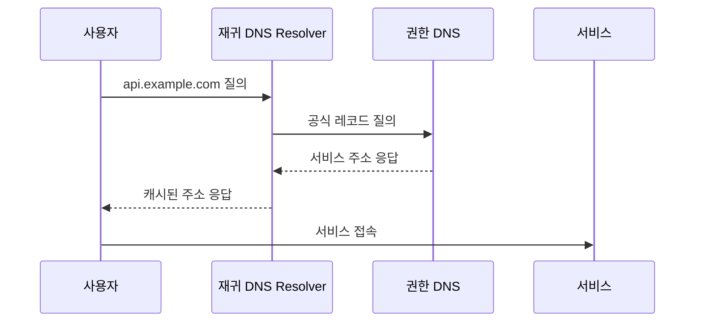

# DNS 기본 개념

[인프라 결정 기록으로 돌아가기](README.md)

## DNS란?

DNS(Domain Name System)는 `example.com` 같은 도메인 이름을 서버 IP 주소나 다른 서비스 주소에 연결하는 분산 시스템이다. 서버 주소가 바뀌더라도 사용자는 같은 도메인으로 접속할 수 있다.

## 기본 용어

- **Domain registrar**: 도메인을 등록하고 소유권과 갱신을 관리하는 사업자
- **Name server**: DNS 질의에 응답하는 서버
- **Authoritative DNS**: 특정 도메인의 공식 레코드를 응답하는 DNS
- **Recursive resolver**: 사용자를 대신해 여러 DNS에 질의하고 결과를 캐시하는 서버
- **Hosted zone**: 한 도메인의 DNS 레코드 모음
- **TTL**: DNS 응답이 캐시에 유지되는 시간

## 주요 레코드

- **A**: 도메인을 IPv4 주소에 연결한다.
- **AAAA**: 도메인을 IPv6 주소에 연결한다.
- **CNAME**: 한 도메인 이름을 다른 도메인 이름에 연결한다.
- **MX**: 해당 도메인의 이메일을 받을 서버를 지정한다.
- **TXT**: 도메인 소유 확인과 이메일 보안 등 문자열 정보를 저장한다.
- **NS**: 도메인의 권한 DNS 서버를 지정한다.

도메인을 구매한 곳과 DNS 레코드를 운영하는 곳은 같을 필요가 없다. 네임서버 설정을 변경하면 다른 DNS 서비스에서 레코드를 관리할 수 있다.

사내망 전용 서비스는 공개 DNS가 아니라 조직 내부에서만 조회 가능한 내부 DNS를 사용할 수 있다.

## 주요 DNS 서비스

### Amazon Route 53

Route 53은 도메인 등록, 권한 DNS, 상태 확인과 DNS 라우팅 기능을 제공하는 AWS 서비스다. Hosted Zone에 레코드를 만들며 AWS 자원을 가리키는 Alias Record 같은 기능을 제공한다.

### Cloudflare DNS

Cloudflare DNS는 Cloudflare가 운영하는 권한 DNS 서비스다. 레코드별로 DNS 응답만 제공하거나 Cloudflare Proxy를 통과하도록 설정할 수 있다. Proxy를 사용하면 사용자에게 원본 서버 대신 Cloudflare 주소가 응답된다.

### 도메인 등록기관의 DNS

도메인을 구매한 Registrar가 함께 제공하는 권한 DNS 서비스다. Registrar의 관리 화면에서 A, CNAME, MX 등의 레코드를 설정하며 지원 기능과 API는 업체마다 다르다.
