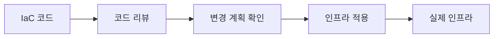

# 인프라 코드 기본 개념

[인프라 결정 기록으로 돌아가기](README.md)

## IaC란?

IaC(Infrastructure as Code)는 서버, 네트워크, 권한과 클라우드 자원을 관리 화면에서 수동으로 만드는 대신 코드 파일로 정의하고 생성·변경하는 방식이다.

## IaC의 목적

- 같은 구성을 반복해서 생성한다.
- 인프라 변경 이력을 Git으로 관리한다.
- 실제 적용 전에 변경 내용을 검토한다.
- 수동 작업과 설정 누락을 줄인다.
- 장애 후 환경을 다시 만드는 절차를 명확히 한다.

## 선언형과 명령형

- **선언형**: 원하는 최종 상태를 정의하면 도구가 현재 상태와 비교해 필요한 변경을 계산한다.
- **명령형**: 자원을 만드는 절차와 순서를 코드로 작성한다.

## 기본 용어

- **Resource**: 서버, 네트워크, DNS 레코드처럼 IaC가 관리하는 개별 대상
- **Provider**: IaC 도구와 클라우드 API를 연결하는 플러그인
- **State**: IaC 코드의 자원과 실제 인프라의 대응 관계를 기록한 정보
- **Plan**: 적용 전에 생성, 변경, 삭제될 자원을 보여주는 결과
- **Apply**: 계획된 변경을 실제 환경에 반영하는 작업
- **Module**: 반복해서 사용할 수 있게 묶은 IaC 구성
- **Drift**: 콘솔의 수동 변경 등으로 실제 자원이 코드의 정의와 달라진 상태
- **Import**: 기존에 만들어진 자원을 IaC 관리 대상으로 가져오는 작업

상태 파일에는 자원 식별자와 민감한 값이 들어갈 수 있으므로 접근을 제한하고 안전하게 보관해야 한다. 또한 IaC 실행 권한은 인프라를 생성하거나 삭제할 수 있는 강한 권한이므로 애플리케이션 권한과 분리해야 한다.

## 주요 IaC 도구와 방식

### Terraform

Terraform은 HCL로 원하는 인프라 상태를 선언하는 IaC 도구다. Provider가 AWS를 비롯한 외부 서비스 API와 통신하고, State를 사용해 코드의 Resource와 실제 자원을 연결한다. `plan`으로 변경을 확인하고 `apply`로 반영한다.

### OpenTofu

OpenTofu는 Terraform 계열의 오픈소스 IaC 도구다. HCL 구성, Provider, State와 Plan/Apply Workflow를 사용한다. Terraform 계열 구성과 유사하지만 실제 도구 버전, Provider와 Module 호환성은 확인해야 한다.

### AWS CDK

AWS CDK(Cloud Development Kit)는 TypeScript, Python, Java 같은 프로그래밍 언어의 Construct로 AWS 자원을 정의하는 프레임워크다. 작성한 코드는 CloudFormation Template으로 변환되고 CloudFormation Stack으로 배포된다.

### 수동 구성과 재현 문서

관리 콘솔이나 CLI에서 사람이 직접 자원을 만들고 모든 단계와 값을 문서로 기록하는 방식이다. 별도 IaC State는 없으며 실제 환경이 문서와 일치하는지는 변경 절차와 점검을 통해 관리한다.
