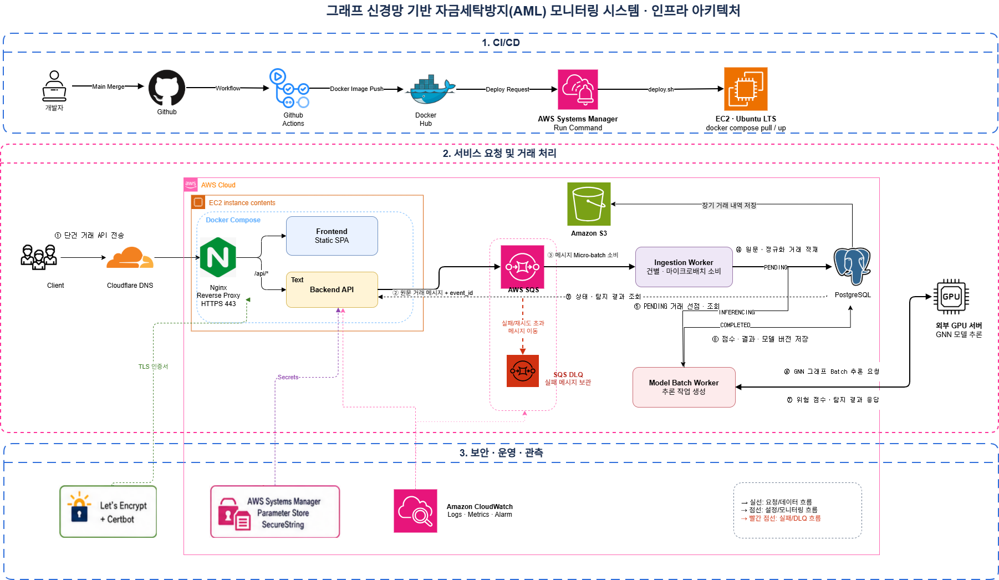

# AML 서비스 실행 구성

## 1차 아키텍처 다이어그램



> 이 이미지는 현재까지 결정한 인프라와 서비스 실행 흐름을 표현한 1차 초안이다. 세부 연결은 아래 본문의 설계를 기준으로 하며, 이미지와 본문이 충돌하는 부분은 문서 하단의 `1차 다이어그램 보정 사항`에 따라 수정한다.

> **기술 확정 범위:** 백엔드 프레임워크와 DB 엔진은 아직 결정하지 않았다. 이 문서의 `Spring Boot`와 `PostgreSQL` 표기는 실행 구조와 데이터 흐름을 구체적으로 설명하기 위한 구현 예시이며, 최종 기술 선택으로 간주하지 않는다. 핵심 설계는 Backend API와 관계형 DB의 구체적인 제품에 의존하지 않도록 유지한다.

## 문서 목적

이 문서는 그래프 신경망 기반 자금세탁방지(AML) 모니터링 시스템의 초기 인프라 구성과 실제 거래 처리 방식을 설명한다. 단순히 어떤 AWS 서비스를 사용하는지만 보여주는 것이 아니라 다음 사항을 함께 기록한다.

- 소스 코드가 운영 서버까지 배포되는 과정
- AML 관리자의 요청이 애플리케이션에 도달하는 과정
- 대용량 거래 원문을 비동기로 적재하는 과정
- 정제된 거래를 그래프로 변환하고 외부 GPU 서버에서 추론하는 과정
- 위험 점수와 탐지 결과를 저장하고 조회하는 과정
- 비밀정보, TLS 인증서, 로그, 메트릭과 실패 메시지를 관리하는 방식
- 향후 다른 클라우드 또는 폐쇄망으로 이전하기 위해 유지할 경계

## 핵심 설계 원칙

- 초기에는 AWS EC2 한 대와 Docker Compose를 사용하여 비용과 운영 복잡도를 낮춘다.
- AWS를 사용하더라도 애플리케이션을 AWS 전용 실행 환경에 과도하게 종속시키지 않는다.
- Ubuntu, Docker, Nginx와 표준 프로토콜처럼 다른 환경에서도 사용할 수 있는 기술을 우선한다. 백엔드 프레임워크와 DB 엔진도 이식성, 팀 경험과 요구사항을 비교한 뒤 결정한다.
- 사용자 HTTP 요청과 오래 걸리는 거래 적재·GNN 추론 작업을 분리한다.
- 거래 원문, 정제 데이터, 작업 메시지와 추론 결과의 책임을 명확히 구분한다.
- 외부 GPU 서버에는 애플리케이션 DB 접속 권한을 제공하지 않는다.
- 비밀정보와 AWS 자원 접근 권한을 애플리케이션 코드 및 Docker 이미지에 포함하지 않는다.
- 로그는 구조화된 표준 출력으로 기록하여 향후 CloudWatch 이외의 수집기로도 전환할 수 있게 한다.

## 확정된 인프라 구성 요약

| 영역 | 현재 선택 | 역할 |
|---|---|---|
| 클라우드 | AWS | 초기 운영 환경 및 관리형 서비스 제공 |
| 서버 | EC2 단일 인스턴스 | 웹 애플리케이션과 Worker 컨테이너 실행 |
| 운영체제 | Ubuntu LTS | 범용 Linux 실행 환경 |
| 컨테이너 실행 | Docker Compose | 단일 EC2의 컨테이너 구성과 실행 관리 |
| 소스 저장소 | GitHub | 소스 코드와 Workflow 관리 |
| CI | GitHub Actions | 테스트 및 Docker 이미지 빌드 |
| 이미지 저장소 | Docker Hub 비공개 Repository | 배포할 컨테이너 이미지 보관 |
| CD | AWS Systems Manager Run Command | SSH 포트 없이 EC2에 배포 명령 전달 |
| Reverse Proxy | Nginx | HTTPS 종료 및 Frontend/API 요청 라우팅 |
| TLS 인증서 | Let's Encrypt + Certbot | 공개 서비스 HTTPS 인증서 발급과 갱신 |
| DNS | Cloudflare DNS-only | 도메인을 EC2의 고정 Public IP에 연결 |
| 장기 원문 Archive | Amazon S3 | DB의 오래된 원문 이벤트를 시간·건수 단위 파일로 장기 보관 |
| 비동기 작업 | Amazon SQS Standard + DLQ | 실시간 거래 메시지 전달, 재시도 및 최종 실패 격리 |
| 데이터베이스 | 관계형 DB 컨테이너 (엔진 미정) | 단기 원문 Payload, 정규화 거래, 처리 상태, 위험 점수와 탐지 결과 저장. PostgreSQL은 구현 예시 |
| 비밀정보 | Parameter Store SecureString | 운영 비밀정보의 암호화 보관 |
| 로그·모니터링 | Amazon CloudWatch | 핵심 로그, 메트릭과 알람 관리 |
| 모델 추론 | 외부 GPU 서버 | GNN 모델 실행 및 추론 결과 반환 |

## 아키텍처 영역별 설명

### CI/CD 영역

개발자가 GitHub의 메인 브랜치에 코드를 반영하면 GitHub Actions가 테스트와 Docker 이미지 빌드를 수행한다. 검증된 이미지는 Docker Hub의 비공개 Repository에 Push한다. 배포 단계에서는 GitHub Actions가 AWS Systems Manager Run Command를 호출하고, EC2의 배포 스크립트가 새 이미지를 Pull한 뒤 Docker Compose 구성을 갱신한다.

```text
개발자 → GitHub Main Merge → GitHub Actions 테스트·빌드

GitHub Actions ── Image Push ──→ Docker Hub
GitHub Actions ── Deploy Request → SSM Run Command
SSM Run Command ── deploy.sh ───→ EC2
EC2 ── docker compose pull ─────→ Docker Hub
EC2 ── docker compose up / Health Check
```

GitHub Actions가 운영 비밀정보를 직접 보유하거나 애플리케이션 설정 파일을 생성하지 않게 한다. GitHub Actions에는 배포 명령을 요청할 수 있는 최소 권한만 제공하고, 실제 운영 비밀정보는 EC2가 Parameter Store에서 조회한다.

### 외부 요청과 네트워크 경계

사용자는 Cloudflare DNS를 통해 EC2의 고정 Public IP를 조회하고 HTTPS 443 포트로 Nginx에 접속한다. Cloudflare는 초기에는 Proxy가 아닌 DNS-only 모드로 사용한다. Nginx는 정적 Frontend 요청과 `/api/*` Backend 요청을 구분하여 내부 컨테이너로 전달한다.

```text
AML 관리자
 → Cloudflare DNS-only
 → EC2 Public IP
 → Nginx HTTPS 443
    ├─ /*      → Frontend Static SPA
    └─ /api/*  → Backend API
```

외부에 공개할 포트는 원칙적으로 HTTPS 443과 인증서 발급·리다이렉트를 위한 HTTP 80으로 제한한다. Backend API, Worker, PostgreSQL 컨테이너 포트는 인터넷에 직접 공개하지 않고 Docker 내부 네트워크에서만 접근하게 한다. 서버 운영 명령은 SSH 공개 대신 SSM Run Command를 우선 사용한다.

### 데이터 저장 책임

각 저장소의 책임을 다음과 같이 분리한다.

| 저장 위치 | 저장 대상 | 저장하지 않는 대상 |
|---|---|---|
| Amazon S3 | 여러 원문 이벤트를 묶은 JSONL/Parquet 장기 Archive | 실시간 거래 1건당 작은 객체, DB 비밀번호, AWS 접근 키 |
| Amazon SQS | 외부 시스템에서 수신한 거래 1건의 원문 메시지와 `event_id` | 장기 보관 데이터, 모델 결과 |
| PostgreSQL | 단기 원문 Payload, 정규화 거래, 적재·추론 상태, 위험 점수, 탐지 결과 | Docker 이미지와 운영 Secret |
| Parameter Store | DB 비밀번호, JWT Secret, GPU 인증키 등 운영 비밀정보 | 거래 데이터 및 로그 |
| Docker Hub | 실행 가능한 애플리케이션 이미지 | 운영 환경의 Secret 및 거래 데이터 |

실시간 처리의 신뢰 가능한 저장소는 PostgreSQL이다. Ingestion Worker는 거래 원문 Payload와 정규화된 거래를 같은 DB 트랜잭션으로 저장한다. S3는 실시간 처리 경로에 포함하지 않고, PostgreSQL에 일정 기간 보관한 원문 이벤트를 시간 또는 건수 단위의 JSONL/Parquet 파일로 묶어 장기 보관하는 Archive 용도로만 사용한다.

## 전체 구성

초기 인프라는 AWS EC2 한 대에서 Docker Compose로 실행한다. API와 백그라운드 작업은 역할별 프로세스로 분리하지만, 모두 동일한 EC2 안에서 실행한다.

```text
AWS EC2 한 대
└─ Docker Compose
   ├─ Nginx
   ├─ Frontend
   ├─ Backend API
   ├─ Ingestion Worker
   ├─ Model Batch Worker
   └─ PostgreSQL
```

컨테이너가 여러 개로 나뉘어 있어도 물리적인 백엔드 서버가 여러 대인 것은 아니다. 현재 구조에서는 하나의 EC2 안에서 각 역할을 담당하는 프로세스를 분리해 실행한다.

## Backend API

외부 금융 거래 시스템의 거래 접수 요청과 AML 관리자의 조회 요청에 빠르게 응답하는 프로세스다.

```text
외부 금융 거래 시스템 → Nginx → Backend API → SQS
AML 관리자 → Nginx → Backend API ↔ PostgreSQL
```

담당 업무는 다음과 같다.

- 로그인 및 권한 확인
- 외부 금융 거래 시스템의 거래 1건 접수
- 거래 식별정보와 최소 형식 검증
- `event_id`와 수신 시각 생성
- 거래 원문 메시지를 SQS에 등록
- 거래 및 탐지 결과 조회
- 관리자 화면에 API 응답 반환

Backend API는 오래 걸리는 거래 적재나 AI 추론을 HTTP 요청 안에서 직접 처리하지 않는다. SQS 등록에 성공하면 외부 거래 시스템에 `202 Accepted`, `event_id`와 접수 상태를 반환하고 실제 저장과 분석은 백그라운드 Worker가 수행한다.

## Ingestion Worker

화면 요청과 관계없이 백그라운드에서 거래 적재 작업을 수행하는 프로세스다. 외부 사용자에게 HTTP API를 제공할 필요가 없다.

```text
SQS에서 거래 메시지를 여러 건 소비
 → 원문 Payload 검증·변환·중복 확인
 → PostgreSQL에 원문 이벤트와 정규화 거래를 같은 트랜잭션으로 저장
 → 정규화 거래의 inference_status를 PENDING으로 설정
 → DB Commit 성공 후 SQS 메시지 삭제
```

거래 메시지가 SQS 크기 제한 안에 들어오는 일반적인 단건 거래 Payload라는 전제로 원문 메시지 자체를 SQS에 전달한다. Ingestion Worker는 최대 건수 또는 최대 대기 시간 기준으로 메시지를 모아 PostgreSQL에 Micro-batch로 적재한다. 거래 1건마다 S3 객체를 생성하지 않는다.

## Model Batch Worker

분석 가능한 거래를 찾아 GNN 추론 작업을 처리하는 백그라운드 프로세스다. 이 Worker 역시 외부에 공개되는 서버가 아니다.

```text
PostgreSQL에서 분석 대상 거래 조회
 → 계좌와 거래 관계를 그래프 입력으로 생성
 → 외부 GPU 서버에 GNN 추론 요청
 → 외부 GPU 서버로부터 추론 결과 수신
 → 위험 점수와 탐지 결과를 PostgreSQL에 저장
```

외부 GPU 서버는 PostgreSQL에 직접 접근하지 않는다. Model Batch Worker가 GPU 서버와 통신하고 결과를 검증한 후 PostgreSQL에 저장한다.

```text
PostgreSQL ↔ Model Batch Worker ↔ 외부 GPU 서버
```

각 연결의 의미는 다음과 같다.

- `PostgreSQL → Model Batch Worker`: 분석 대상 거래 조회
- `Model Batch Worker → 외부 GPU 서버`: GNN 추론 요청
- `외부 GPU 서버 → Model Batch Worker`: 추론 결과 응답
- `Model Batch Worker → PostgreSQL`: 위험 점수와 탐지 결과 저장
- `외부 GPU 서버 ↔ PostgreSQL`: 직접 연결하지 않음

## 전체 거래 처리 흐름

```text
외부 금융 거래 시스템
 → Nginx
 → Backend API
 → 거래 원문 메시지를 SQS에 등록
 → Ingestion Worker가 SQS 거래 메시지를 여러 건 소비
 → 원문 Payload와 정규화 거래를 PostgreSQL에 Micro-batch 적재
 → inference_status를 PENDING으로 설정
 → Model Batch Worker가 PENDING 거래와 연관 거래를 PostgreSQL에서 조회
 → GNN 입력 그래프 생성
 → 외부 GPU 서버에 추론 요청
 → Model Batch Worker가 추론 결과 수신
 → 위험 점수, 탐지 결과, 모델 버전을 PostgreSQL에 저장
 → inference_status를 COMPLETED로 변경
 → Backend API가 탐지 결과 조회
 → AML 관리자 화면에 결과 반환

장기 보관 작업
 → PostgreSQL의 오래된 원문 이벤트를 시간·건수 단위로 조회
 → JSONL/Parquet 파일 생성
 → S3 Archive 업로드 및 검증
 → PostgreSQL에 ARCHIVED 상태 기록
```

## Worker 간 연결 및 거래 추론 상태 관리

Ingestion Worker가 거래 데이터를 Model Batch Worker에 직접 전달하는 구조는 사용하지 않는다. 두 Worker는 PostgreSQL에 저장된 정규화 거래와 거래별 `inference_status`를 통해 느슨하게 연결한다. `inference_batch_id`는 여러 거래가 같은 GPU 요청에 포함됐음을 묶어 추적하는 식별자이며 상태 자체가 아니다.

### 권장 처리 흐름

```text
1. Backend API
   ├─ 거래 1건의 인증·최소 형식 확인
   ├─ event_id와 received_at 생성
   └─ 거래 원문 메시지 → SQS 전송

2. Ingestion Worker
   ├─ SQS 거래 메시지를 여러 건 소비
   ├─ 거래 데이터 검증·변환·중복 제거
   ├─ PostgreSQL에 원문 Payload와 정규화 거래를 Micro-batch 적재
   └─ inference_status를 PENDING으로 변경

3. Model Batch Worker
   ├─ PENDING 상태의 거래를 일정 시간·건수 기준으로 선점
   ├─ PostgreSQL에서 대상 거래 및 연관 거래 조회
   ├─ GNN 입력 그래프 생성
   ├─ 외부 GPU 서버에 추론 요청
   ├─ 위험 점수, 탐지 결과와 모델 버전을 PostgreSQL에 저장
   └─ inference_status를 COMPLETED로 변경
```

### 직접 전달하지 않는 이유

다음과 같은 직접 연결은 사용하지 않는다.

```text
Ingestion Worker → 거래 데이터 직접 전달 → Model Batch Worker
```

이 구조에서는 Model Batch Worker가 실패했을 때 Ingestion Worker의 작업부터 다시 실행해야 할 수 있으며 두 Worker가 강하게 결합된다. 대신 PostgreSQL에 데이터와 작업 상태를 기록하면 각 작업을 독립적으로 재실행할 수 있다.

### 거래별 inference_status

`inference_status`는 정규화된 각 거래가 GNN 분석 과정에서 어느 단계에 있는지를 나타낸다. 파일 배치 상태나 SQS 상태와 혼합하지 않는다.

```text
PENDING
    ↓ Model Batch Worker가 거래 묶음을 선점
INFERENCING
    ├─ 추론 및 결과 저장 성공 → COMPLETED
    ├─ 일시적 실패 → RETRY_WAIT → PENDING
    └─ 재시도 초과·영구 오류 → FAILED
```

| 상태 | 변경 주체 | 변경 시점 |
|---|---|---|
| `PENDING` | Ingestion Worker | 원문 Payload와 정규화 거래를 PostgreSQL에 Commit한 시점 |
| `INFERENCING` | Model Batch Worker | PENDING 거래들을 선점하고 `inference_batch_id`를 할당한 시점 |
| `RETRY_WAIT` | Model Batch Worker | GPU Timeout 등 재시도 가능한 오류가 발생한 시점 |
| `COMPLETED` | Model Batch Worker | 위험 점수, 탐지 결과와 모델 버전을 PostgreSQL에 Commit한 시점 |
| `FAILED` | Model Batch Worker | 최대 재시도 횟수를 초과했거나 복구 불가능한 오류가 발생한 시점 |

`COMPLETED`는 GPU 응답을 받은 순간이 아니라 추론 결과의 PostgreSQL 저장까지 성공한 뒤 설정한다. `RETRY_WAIT`에는 `retry_count`, `next_retry_at`과 `last_error`를 기록하고 재시도 시각이 되면 다시 `PENDING`으로 변경한다. 운영자가 `FAILED` 거래를 수동 재처리하는 경우에도 상태를 `PENDING`으로 되돌린다.

Model Batch Worker가 `INFERENCING` 변경 후 중단되는 상황에 대비해 `inference_lease_until`을 기록한다. Lease가 만료된 거래는 복구 작업이 `RETRY_WAIT` 또는 `PENDING`으로 되돌려 다시 처리할 수 있게 한다.

### 적재 상태와 추론 상태의 구분

`RECEIVED`, `INGESTING` 같은 값은 `inference_status`에 넣지 않는다. Backend API가 SQS 등록을 완료한 상태는 SQS 메시지와 API 응답으로 표현하고, 적재 성공·거부 여부가 필요하면 `raw_transaction_event.ingestion_status`에서 별도로 관리한다.

```text
SQS / ingestion_status
  거래 접수·소비·검증·DB 적재 상태

transaction.inference_status
  PENDING·INFERENCING·RETRY_WAIT·COMPLETED·FAILED
```

### 두 Worker 사이의 실제 연결

초기에는 별도의 추론 큐를 추가하지 않고 PostgreSQL을 통해 연결한다.

```text
Ingestion Worker
   → PostgreSQL에 원문 Payload와 정규화 거래 적재
   → inference_status를 PENDING으로 변경

PostgreSQL
   → Model Batch Worker가 PENDING 거래를 시간·건수 기준으로 조회
```

다이어그램의 연결은 다음과 같이 표현한다.

```text
SQS ───────────────→ Ingestion Worker
Ingestion Worker ──→ PostgreSQL
PostgreSQL ────────→ Model Batch Worker
Model Batch Worker → 외부 GPU 서버
외부 GPU 서버 ─────→ Model Batch Worker
Model Batch Worker → PostgreSQL
```

`Ingestion Worker → Model Batch Worker` 직접 화살표는 표시하지 않는다.

### 향후 확장

처리량이 증가하거나 추론 작업을 독립적으로 확장해야 하는 경우 두 Worker 사이에 추론 전용 큐를 추가할 수 있다.

```text
Ingestion Worker
   → Inference Queue
   → Model Batch Worker
```

현재 규모에서는 큐를 추가하기보다 PostgreSQL의 `inference_status`를 기준으로 Model Batch Worker가 작업을 조회하는 구성이 단순하다. Model Batch Worker를 여러 개 실행할 경우 동일한 거래 묶음이 중복 처리되지 않도록 상태 변경과 작업 선점을 하나의 트랜잭션으로 처리해야 한다.

## DB 원문·정규화 저장 (PostgreSQL 예시)

Ingestion Worker는 거래 원문과 정규화 데이터를 선택할 관계형 DB에 저장한다. 아래 테이블과 `JSONB` 타입은 PostgreSQL을 선택했을 때의 구현 예시이며, 다른 DB를 선택하면 동등한 원문 보존 타입과 제약조건으로 조정한다. 초기에는 별도 테이블로 분리하는 구성을 기본으로 한다.

```text
raw_transaction_event
├─ event_id
├─ transaction_id
├─ received_at
├─ raw_payload JSONB
├─ ingestion_status
├─ retry_count
└─ error_reason

transaction
├─ transaction_id
├─ source_account_id
├─ destination_account_id
├─ amount
├─ transaction_at
├─ inference_status
├─ inference_batch_id
├─ inference_retry_count
├─ inference_next_retry_at
├─ inference_lease_until
├─ inference_last_error
├─ risk_score
├─ model_version
└─ inferred_at
```

두 레코드는 하나의 PostgreSQL 트랜잭션 안에서 저장한다.

```text
BEGIN
 → raw_transaction_event 저장
 → transaction 정규화 저장
COMMIT
 → SQS 메시지 삭제
```

DB Commit에 실패하면 SQS 메시지를 삭제하지 않고 재전달되게 한다. `event_id`와 `transaction_id`에 고유 제약조건을 두어 동일 메시지가 다시 전달돼도 중복 거래가 생성되지 않게 한다.

## S3 장기 Archive

S3는 실시간 거래 처리 경로에서 사용하지 않는다. 거래 한 건마다 작은 S3 객체를 생성하지 않고, PostgreSQL의 오래된 원문 이벤트를 일정 시간 또는 건수 단위로 묶어 장기 보관한다.

```text
PostgreSQL raw_transaction_event
 → 아직 Archive되지 않은 원문 조회
 → JSONL 또는 Parquet 파일 생성
 → S3 업로드
 → 건수·Checksum 검증
 → ARCHIVED 상태 기록
 → 보존 기간이 지난 PostgreSQL raw_payload 정리
```

정규화 거래, 위험 점수와 탐지 결과는 PostgreSQL에 유지한다. PostgreSQL의 원문 Payload는 재처리와 오류 조사에 필요한 기간만 보관하고, 검증된 S3 Archive가 생성된 이후 정책에 따라 정리한다.

## Parameter Store 설정 관리

Parameter Store에는 애플리케이션 실행에 필요한 환경 설정과 비밀정보를 저장한다. 민감한 값은 `SecureString`으로 저장하며, 각 컴포넌트에는 필요한 값만 전달한다.

### 컴포넌트별 필요한 값

| 대상 | 필요한 설정 |
|---|---|
| Backend API | DB 접속정보, JWT 비밀키, SQS 주소 |
| Ingestion Worker | DB 접속정보, SQS 주소 |
| Model Batch Worker | DB 접속정보, 외부 GPU 서버 주소 및 인증키 |
| Archive 작업 | DB 접속정보, S3 Archive 버킷명 |
| DB 컨테이너 (PostgreSQL 예시) | 초기 DB 사용자 및 비밀번호 |
| Nginx | 일반적으로 필요 없음 |
| Frontend SPA | 비밀정보를 전달하면 안 됨 |

예상되는 Parameter Store 경로는 다음과 같다.

```text
/aml/prod/database/url
/aml/prod/database/username
/aml/prod/database/password
/aml/prod/jwt/secret
/aml/prod/gpu/base-url
/aml/prod/gpu/api-key
/aml/prod/s3/bucket-name
/aml/prod/sqs/queue-url
```

AWS 접근 키인 `AWS_ACCESS_KEY_ID`와 `AWS_SECRET_ACCESS_KEY`는 Parameter Store에 저장해서 컨테이너에 전달하지 않는다. EC2에서 S3, SQS, Parameter Store 및 CloudWatch에 접근할 때는 EC2 IAM Role을 사용한다.

Parameter Store가 컨테이너에 값을 직접 전달하는 것은 아니다. EC2의 배포 스크립트가 IAM Role을 이용하여 설정을 조회하고 환경변수 또는 별도의 환경 설정 파일로 Docker Compose에 주입한다. 애플리케이션은 Parameter Store에 직접 종속되지 않고 일반 환경변수로 설정을 받도록 구성한다.

## IAM과 AWS 자원 접근

EC2 내부 애플리케이션이 AWS 서비스를 사용할 때 장기 Access Key를 컨테이너에 저장하지 않는다. EC2 Instance Role에 필요한 권한만 부여하고 AWS SDK의 기본 자격 증명 체인을 통해 임시 자격 증명을 사용한다.

```text
EC2 Instance Role
├─ 지정된 S3 Bucket 읽기·쓰기
├─ 지정된 SQS Queue 메시지 송수신
├─ 필요한 Parameter 경로 읽기
├─ KMS 복호화
└─ CloudWatch 로그 전송
```

권한은 전체 S3, 전체 SQS 또는 전체 Parameter Store에 부여하지 않고 프로젝트와 운영 환경의 자원 경로로 제한한다. 외부 GPU 서버에는 AWS IAM Role이나 PostgreSQL 접속정보를 전달하지 않는다.

## 보안 구성

### TLS 인증서

Let's Encrypt와 Certbot은 Nginx가 사용하는 TLS 인증서를 발급하고 갱신한다. 인증서 관련 연결은 거래 데이터 흐름이 아니라 설정 흐름이므로 다이어그램에서 녹색 점선으로 표현한다.

```text
Let's Encrypt + Certbot
  ─ ─ TLS 인증서 발급·갱신 ─ ─→ Nginx
```

### 비밀정보

운영 비밀정보는 Parameter Store의 `SecureString`으로 암호화해 보관한다. 배포 스크립트가 EC2 Instance Role로 필요한 값만 조회하고 제한된 권한의 Secret 파일 또는 환경 설정으로 각 컨테이너에 주입한다.

```text
Parameter Store SecureString
  ─ ─→ EC2 Secret Bootstrap
        ├─→ Backend API
        ├─→ Ingestion Worker
        ├─→ Model Batch Worker
        └─→ PostgreSQL
```

Nginx에는 일반적으로 애플리케이션 Secret이 필요하지 않으며 Frontend SPA에는 어떠한 서버 비밀정보도 포함하면 안 된다. S3와 SQS 접근에는 Access Key가 아니라 EC2 Instance Role을 사용한다.

## 로그·메트릭·알람

CloudWatch는 데이터가 이동하는 경로가 아니라 운영 상태를 관측하는 목적의 서비스다. 따라서 서비스에서 CloudWatch로 향하는 회색 점선으로 표현한다.

```text
EC2 및 Docker Compose ─ ─→ CloudWatch
SQS 및 DLQ           ─ ─→ CloudWatch
```

다이어그램을 단순하게 유지하기 위해 개별 컨테이너마다 선을 그리지 않고 Docker Compose 전체 경계에서 CloudWatch로 연결할 수 있다. 상세 수집 대상은 다음과 같다.

| 대상 | 관측 항목 |
|---|---|
| EC2 | 인스턴스 상태, CPU, 네트워크, 메모리와 디스크 사용률 |
| Nginx | 접근 오류, 4xx·5xx, Upstream 연결 실패 |
| Backend API | API 오류율, 요청 지연, 배치 접수 실패 |
| Ingestion Worker | 적재 성공·실패, 처리 건수, 소요 시간 |
| Model Batch Worker | 추론 성공·실패, GPU 호출 지연과 재시도 |
| PostgreSQL | 연결 오류, 디스크 부족, 장기 실행 Query 관련 로그 |
| SQS | 대기 메시지 수, 가장 오래된 메시지의 대기 시간 |
| DLQ | 최종 실패 메시지 수 |

컨테이너 로그는 구조화된 JSON을 표준 출력과 표준 오류로 기록하고 로그 수집 계층이 CloudWatch Logs로 전달한다. 거래 원문, 전체 계좌번호, 인증 토큰, 비밀번호와 Secret은 로그에 기록하지 않는다.

## 실패와 재처리

SQS Standard Queue는 동일한 메시지를 한 번 이상 전달할 수 있으므로 Ingestion Worker는 중복 실행되어도 결과가 달라지지 않는 멱등 처리를 구현해야 한다. `event_id`와 `transaction_id`를 기준으로 중복 적재를 방지한다.

```text
처리 성공
  Ingestion Worker → SQS 메시지 삭제

일시적 실패
  Visibility Timeout 만료 → SQS 재전달

재시도 한도 초과
  SQS → DLQ
```

DLQ 메시지는 자동으로 성공 처리하지 않는다. 운영자가 오류 원인, DLQ의 거래 메시지와 PostgreSQL의 원문 이벤트를 확인하고 문제를 수정한 후 재처리 여부를 결정한다. 이벤트 상태, 재시도 횟수, 마지막 오류와 처리 시각을 PostgreSQL에 기록한다.

외부 GPU 서버 호출에도 연결 시간 제한, 전체 응답 시간 제한과 제한된 재시도를 적용한다. GPU 서버가 일시적으로 응답하지 않더라도 Backend API의 사용자 요청과 Ingestion Worker의 적재 결과가 함께 실패하지 않도록 작업 상태를 분리한다.

## 배포와 롤백

배포 이미지는 `latest`만 사용하지 않고 Git Commit SHA 또는 릴리스 버전으로 식별한다. 배포 스크립트는 새 이미지 실행 후 Health Check를 확인하고 실패하면 직전 정상 이미지 태그로 복구할 수 있어야 한다.

```text
GitHub Actions
 → 테스트
 → 이미지 빌드
 → 취약점 검사
 → Docker Hub Push: commit-sha
 → SSM Run Command
 → docker compose pull
 → docker compose up -d
 → Health Check
    ├─ 성공 → 배포 완료
    └─ 실패 → 이전 이미지로 롤백
```

배포 스크립트, Compose 파일과 Health Check 명령은 저장소에서 버전 관리한다. 핵심 빌드·테스트·배포 명령은 GitHub Actions 전용 문법에만 넣지 않고 로컬에서도 실행 가능한 스크립트로 분리한다.

## 단일 EC2 구성의 한계

현재 구성은 초기 비용과 구현 난이도를 낮추지만 EC2 한 대가 전체 서비스의 단일 장애 지점이다. EC2 또는 디스크 장애가 발생하면 Nginx, Backend, Worker와 PostgreSQL이 함께 중단될 수 있다.

다음 조건이 발생하면 구조를 재검토한다.

- 단일 서버 CPU, 메모리 또는 디스크가 지속적으로 부족한 경우
- 배포 중단을 허용할 수 없거나 고가용성이 필요한 경우
- PostgreSQL 데이터의 중요도가 높아져 별도 장애 복구 목표가 필요한 경우
- Ingestion 또는 Model Worker만 독립적으로 확장해야 하는 경우
- 외부 GPU 추론 요청의 처리량이 단일 Worker 용량을 초과하는 경우
- 운영 인력이 직접 서버와 DB를 관리하는 비용이 관리형 서비스 비용보다 커지는 경우

성장 단계에서는 PostgreSQL을 별도 서버 또는 RDS로 이전하고, Worker를 별도 EC2나 컨테이너 오케스트레이션 환경으로 분리하는 방안을 우선 검토한다.

## 1차 다이어그램 보정 사항

현재 `자금세탁소drawio.png`는 전체 구성을 설명하기 위한 1차 이미지다. 최종 다이어그램에서는 다음 사항을 수정해야 한다.

1. `Ingestion Worker → Model Batch Worker` 직접 화살표를 제거한다.
2. 입력 주체를 AML 관리자가 아니라 `외부 금융 거래 시스템`으로 표시하고 거래가 한 건씩 지속적으로 들어오는 흐름을 추가한다.
3. `Backend API → S3`와 `S3 → Ingestion Worker` 실시간 처리 화살표를 제거한다.
4. `Backend API → SQS`는 `거래 원문 메시지 + event_id` 전달로 표시한다.
5. `SQS → Ingestion Worker`는 `거래 메시지 여러 건 소비`로 표시한다.
6. `Ingestion Worker → PostgreSQL` 화살표는 `원문 Payload + 정규화 거래 Micro-batch 적재, PENDING 상태 설정`을 의미하게 한다.
7. `PostgreSQL → Model Batch Worker` 화살표를 추가하고 `PENDING 거래·연관 거래 조회`로 표시한다.
8. `Model Batch Worker → PostgreSQL` 화살표를 추가하고 `위험 점수·탐지 결과·모델 버전 저장`으로 표시한다.
9. `Model Batch Worker ↔ 외부 GPU 서버`는 `추론 요청 / 결과 응답`의 양방향 통신으로 표현한다.
10. 외부 GPU 서버와 PostgreSQL 사이에는 직접 연결을 그리지 않는다.
11. S3는 실시간 처리 영역에서 제거하고 `PostgreSQL Raw Events → S3 장기 Archive`의 별도 비동기 경로로 표시한다.
12. `조회·모니터링`을 하나의 화살표로 표현하지 않는다. 업무 결과 조회는 `PostgreSQL ↔ Backend API`, 운영 관측은 `서비스 ─ ─→ CloudWatch`로 분리한다.
13. CloudWatch 연결은 거래 데이터 흐름이 아닌 회색 점선의 로그·메트릭 흐름으로 표현한다.
14. Parameter Store는 컨테이너에 직접 값을 Push하는 것이 아니라 EC2 배포 스크립트가 조회·주입한다는 의미로 표현한다.
15. CI/CD는 `GitHub Actions → Docker Hub` 이미지 Push와 `GitHub Actions → SSM Run Command` 배포 요청을 두 갈래로 표현한다. Docker Hub에서 SSM으로 연결하지 않는다.

최종 핵심 연결은 다음과 같다.

```text
외부 금융 거래 시스템 ── 거래 1건 ─→ Backend API
Backend API ── 원문 메시지/event_id ─→ SQS
SQS ── 거래 메시지 여러 건 소비 ───→ Ingestion Worker
Ingestion Worker ── 원문+정규화 Micro-batch 적재 ─→ PostgreSQL
PostgreSQL ── PENDING·연관 거래 조회 ─→ Model Batch Worker
Model Batch Worker ── 추론 요청 ────→ 외부 GPU 서버
외부 GPU 서버 ── 결과 응답 ─────────→ Model Batch Worker
Model Batch Worker ── 점수·결과·모델 버전 저장 ─→ PostgreSQL
PostgreSQL ↔ Backend API ── 탐지 결과 조회
PostgreSQL Raw Events ── 시간·건수 단위 Archive ─→ S3
Docker Compose ─ ─ Logs/Metrics ─ ─→ CloudWatch
SQS/DLQ ─ ─ Queue Metrics ─ ───────→ CloudWatch
```

## 아키텍처 분류

현재 구성은 MSA가 아니라 **모듈러 모놀리스와 비동기 Worker 구조**에 가깝다. API와 Worker는 책임과 실행 프로세스가 나뉘지만, 하나의 백엔드 코드베이스와 공용 관계형 DB를 공유하고 하나의 EC2에서 함께 배포할 수 있다.

백엔드 프레임워크는 아직 미정이다. Spring Boot를 선택한다면 동일 코드베이스와 Docker 이미지를 사용하면서 실행 모드 또는 Profile만 API, Ingestion Worker, Model Batch Worker로 구분할 수 있다. 다른 프레임워크를 선택해도 동일한 역할 분리 원칙을 적용하며, 향후 처리량, 장애 격리 또는 독립 확장이 필요해지면 특정 Worker를 별도 서버나 서비스로 분리한다.
