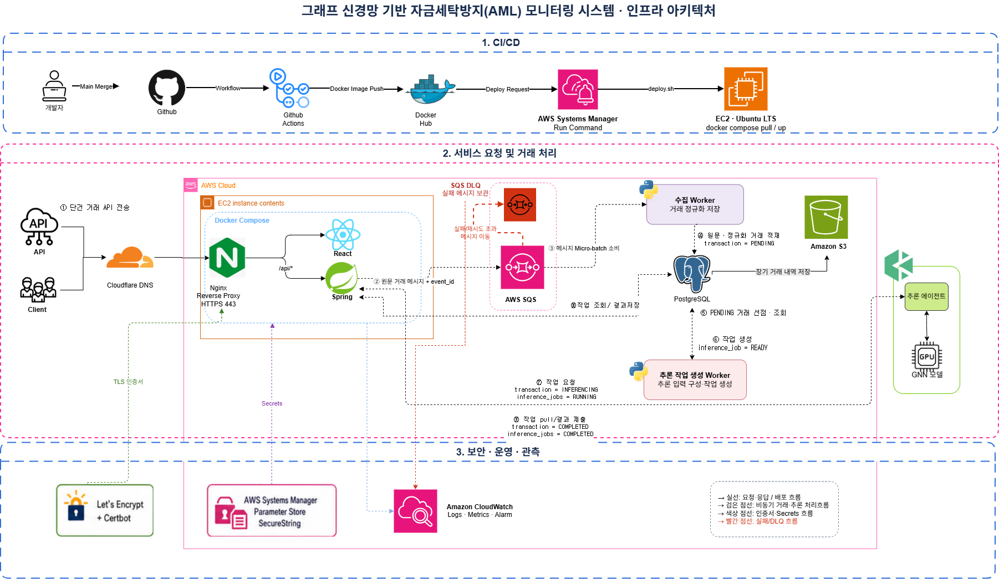
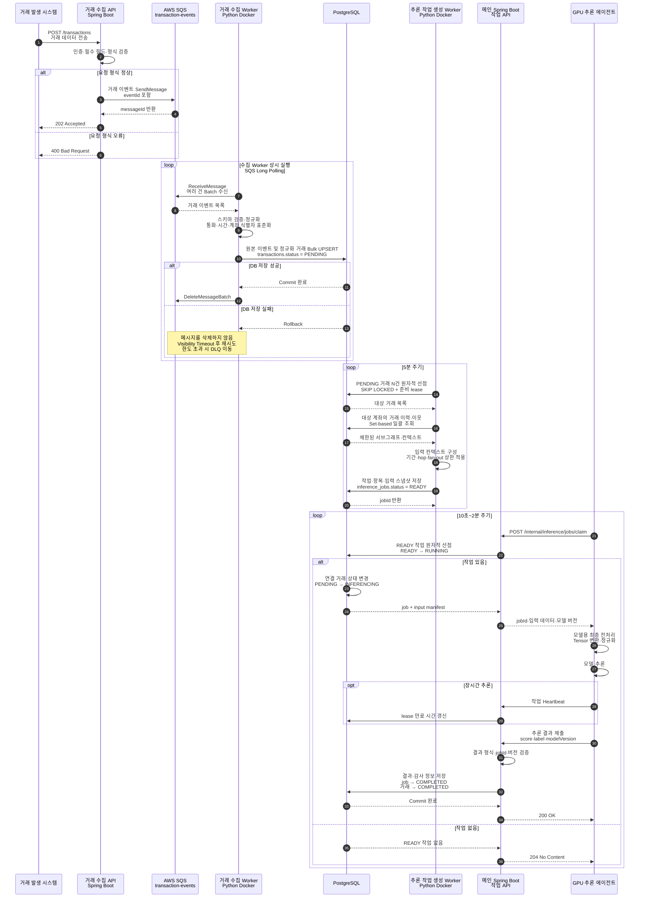
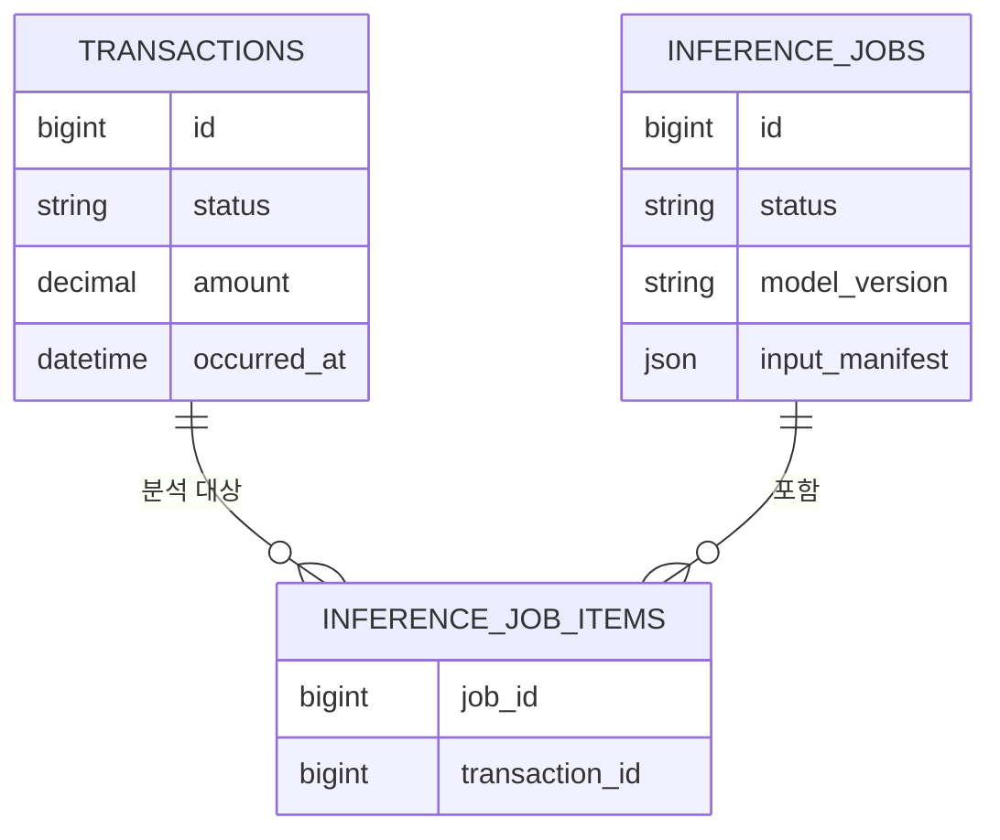
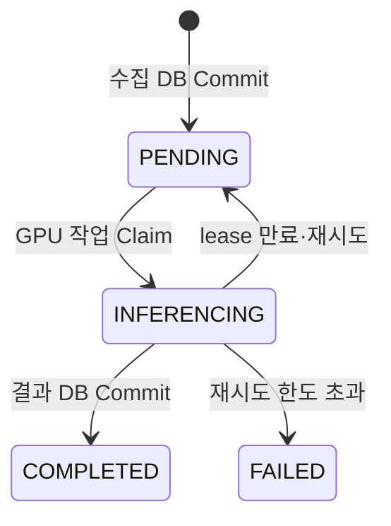
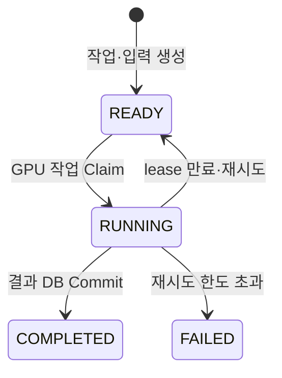
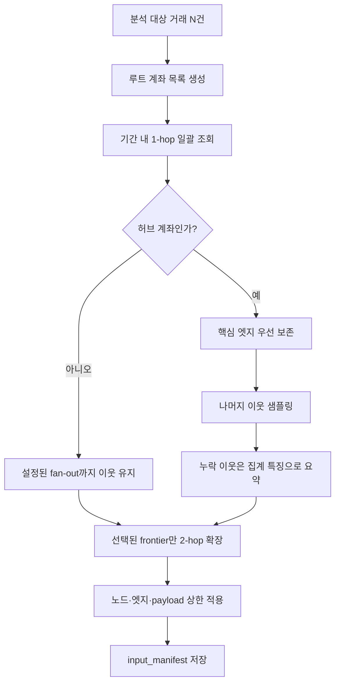

# AML 모니터링 시스템 인프라 아키텍처 V2

> 문서 상태: 기획·설계 기준안  
> 기준 도면: `아키텍처v2.drawio` / `아키텍처v2.png`  
> 범위: 거래 접수, 비동기 수집, 추론 작업 생성, 외부 GPU 추론, 결과 저장, 운영·보안

## 1. V2 아키텍처 다이어그램

[Draw.io 원본 열기](아키텍처v2.drawio)



### 연결선 범례

| 표현 | 의미 |
|---|---|
| 검은 실선 | 동기 요청·응답 및 배포 흐름 |
| 검은 점선 | 비동기 거래·추론 작업 처리 흐름 |
| 파란 점선 | 로그·메트릭·알람 전송 |
| 초록 점선 | TLS 인증서 설정 흐름 |
| 보라 점선 | Secrets 설정 주입 흐름 |
| 빨간 점선 | 처리 실패·재시도·DLQ 흐름 |

SQS 재시도와 DLQ 이동은 다음 의미로 해석한다.

- 수집 Worker가 DB 저장에 실패하면 SQS 메시지를 삭제하지 않는다.
- Visibility Timeout이 지나면 메인 SQS가 메시지를 다시 전달한다.
- 수신 횟수가 `maxReceiveCount`를 초과하면 SQS Redrive Policy가 메시지를 DLQ로 이동한다.
- DLQ는 자동 재시도 큐가 아니라 최종 실패 메시지를 격리·보관하는 큐다.

---

## 2. 한 문장으로 보는 전체 구조

거래 수집 API가 거래 이벤트를 SQS에 넣고, 수집 Worker가 이를 정규화해 PostgreSQL에 저장하며, 추론 작업 생성 Worker가 모델 입력 스냅샷을 `READY` 작업으로 만든 뒤, 외부 GPU 추론 에이전트가 Spring Boot 작업 API를 통해 작업을 Claim하고 결과를 제출하는 구조다.

```text
거래 발생 시스템
→ Nginx / Spring Boot 거래 API
→ SQS
→ 수집 Worker
→ PostgreSQL
→ 추론 작업 생성 Worker
→ inference_jobs READY
→ Spring Boot 작업 API
→ GPU 추론 에이전트 / 모델
→ Spring Boot 결과 API
→ PostgreSQL
```

### V2에서 확정한 핵심 원칙

- 수집 Worker와 추론 작업 생성 Worker는 장시간 실행되는 Python Docker 컨테이너다.
- 수집 Worker는 저장을 위한 검증·정규화를 담당한다.
- 추론 작업 생성 Worker는 분석 대상 선점, 이력·그래프 조회, 입력 스냅샷 생성을 담당한다.
- GPU 추론 에이전트는 PostgreSQL에 직접 접근하지 않는다.
- GPU 추론 에이전트는 Spring Boot 작업 API에서 작업을 Claim하고 결과를 다시 API로 제출한다.
- 실제 모델 추론은 GPU 에이전트가 실행한다. 작업 생성 Worker는 모델을 실행하지 않는다.
- 초기에는 HGB 등 일반 모델로 성능을 확인하고, 같은 작업 계약을 유지하면서 GNN 입력으로 확장한다.
- PostgreSQL은 거래, 작업 상태, 입력 스냅샷, 결과의 기준 저장소(SSOT)다.

---

## 3. 구성 요소와 책임

| 구성 요소 | 실행 위치 | 한 줄 역할 | 주요 책임 |
|---|---|---|---|
| Cloudflare DNS | 외부 | 서비스 도메인 연결 | 도메인을 EC2 공개 주소에 연결 |
| Nginx | EC2 Docker Compose | HTTPS 종료·요청 라우팅 | React와 Spring Boot 요청 분기, TLS 적용 |
| React | EC2 Docker Compose | AML 모니터링 UI | 거래·탐지 결과·운영 상태 조회 |
| Spring Boot | EC2 Docker Compose | 거래·작업 API | 거래 접수, SQS 발행, 작업 Claim, 결과 검증·저장 |
| Amazon SQS | AWS | 거래 이벤트 버퍼 | 트래픽 완충, 비동기 전달, 재시도 |
| SQS DLQ | AWS | 최종 실패 메시지 격리 | 재시도 한도를 넘긴 메시지 보관 |
| 수집 Worker | EC2 Python Docker | 거래 검증·정규화·저장 (`PENDING`) | SQS Long Polling, 중복 방지, Bulk UPSERT |
| PostgreSQL | EC2 Docker Compose | 시스템 기준 데이터 저장소 | 거래, 추론 작업, 상태, 입력, 결과 저장 |
| 추론 작업 생성 Worker | EC2 Python Docker | 추론 입력 구성·작업 생성 (`READY`) | 대상 선점, 이력·이웃 일괄 조회, 입력 스냅샷 생성 |
| 추론 에이전트 | 외부 GPU 서버 | 작업 Claim·모델 실행·결과 제출 | 전처리, Tensor 변환, 모델 추론, Heartbeat |
| HGB/GNN 모델 | 외부 GPU 서버 | 위험 점수 계산 | 일반 모델부터 시작해 GNN으로 단계적 확장 |
| Amazon S3 | AWS | 장기 거래 이력 아카이브 | 오래된 원문 이벤트를 JSONL/Parquet로 장기 보관 |
| Parameter Store | AWS | 운영 설정·Secret 보관 | DB 비밀번호, JWT/API 인증 정보 등 관리 |
| CloudWatch | AWS | 로그·메트릭·알람 | 애플리케이션, EC2, SQS, DLQ 관측 |

### Worker 도면 표기

```text
수집 Worker
거래 검증·정규화·저장 (PENDING)
```

```text
추론 작업 생성 Worker
추론 입력 구성·작업 생성 (READY)
```

---

## 4. CI/CD 및 배포 흐름

```text
개발자 → GitHub Main Merge → GitHub Actions
GitHub Actions → Docker Hub: Docker Image Push
GitHub Actions → AWS Systems Manager: Deploy Request / Send Command
AWS Systems Manager → EC2: deploy.sh 실행
EC2 → Docker Hub: docker compose pull
EC2: docker compose up -d / Health Check
```

도면의 `Deploy Request`는 배포 단계를 단순화해 표시한 것이다. 실제 요청 주체는 Docker Hub가 아니라 GitHub Actions이며, EC2가 Docker Hub에서 이미지를 Pull한다.

- EC2 운영에는 SSH 공개보다 Systems Manager Run Command를 우선한다.
- GitHub Actions에는 배포 명령 실행에 필요한 최소 권한만 부여한다.
- 애플리케이션 Secret을 GitHub Actions 로그나 Docker 이미지에 포함하지 않는다.
- EC2는 IAM Role로 SQS, S3, Parameter Store, CloudWatch에 접근한다.

---

## 5. 전체 거래·추론 시퀀스



### 작업 API 예시

| API | 역할 |
|---|---|
| `POST /internal/inference/jobs/claim` | `READY` 작업을 원자적으로 `RUNNING`으로 변경하고 입력 반환 |
| `POST /internal/inference/jobs/{id}/heartbeat` | 장시간 작업의 lease 연장 |
| `POST /internal/inference/jobs/{id}/result` | 결과 검증 후 저장 및 `COMPLETED` 전환 |
| `POST /internal/inference/jobs/{id}/fail` | 실패 내용 기록, 재시도 또는 최종 `FAILED` 처리 |

외부 GPU 에이전트는 Spring 컨테이너에 직접 연결하지 않고 HTTPS와 Nginx를 통해 작업 API에 접근한다. API Key, 서명 토큰 또는 mTLS 등 서비스 간 인증을 적용한다.

---

## 6. Worker를 쉽게 이해하기

### 6.1 수집 Worker

수집 Worker는 **SQS 메시지를 안전하게 DB 거래로 바꾸는 저장 담당자**다. 모델과 관련된 특징 계산이나 GNN 추론은 수행하지 않는다.

```text
입력: SQS 거래 이벤트
처리: 검증 → 정규화 → 중복 확인 → Bulk UPSERT
출력: transactions.status = PENDING
성공 조건: PostgreSQL Commit 이후 SQS 메시지 삭제
```

주요 처리:

1. SQS를 Long Polling해 여러 메시지를 Batch로 받는다.
2. 필수 필드, 금액, 통화, 발생 시각, 계좌 식별자를 검증한다.
3. 시간대·통화·식별자 형식을 표준화한다.
4. `event_id`를 기준으로 중복 메시지를 제거한다.
5. 원본 이벤트와 정규화 거래를 하나의 DB 트랜잭션으로 저장한다.
6. DB Commit에 성공한 메시지만 `DeleteMessageBatch`로 삭제한다.

수집 Worker에서 수행하는 전처리는 **저장 표준화**다. 모델 버전에 따라 달라지는 스케일링, 인코딩, Tensor 변환은 여기에 넣지 않는다.

### 6.2 추론 작업 생성 Worker

추론 작업 생성 Worker는 **분석할 거래를 묶고 모델이 사용할 입력 스냅샷을 만드는 작업 준비 담당자**다. GPU 모델 자체는 실행하지 않는다.

```text
입력: PENDING 거래와 관련 거래 이력
처리: 대상 선점 → 이력·이웃 일괄 조회 → 입력 컨텍스트 구성
출력: inference_jobs.status = READY
```

주요 처리:

1. 5분마다 아직 활성 작업에 포함되지 않은 `PENDING` 거래 N건을 선점한다.
2. 긴 잠금을 피하기 위해 짧은 트랜잭션에서 준비용 claim과 lease만 기록한다.
3. 선택된 모든 거래의 계좌 목록을 모아 이력과 이웃을 Set-based로 일괄 조회한다.
4. 기간, hop, fan-out, 최대 노드·엣지 수를 적용한다.
5. 일반 모델이면 테이블형 특징을, GNN이면 제한된 서브그래프를 입력에 포함한다.
6. 입력 스냅샷과 모델·특징 버전을 `inference_jobs`에 저장한다.
7. 대상 거래를 `inference_job_items`로 연결하고 작업을 `READY`로 만든다.

### 6.3 GPU 추론 에이전트

GPU 추론 에이전트는 **준비된 작업을 가져와 모델을 실행하고 결과를 돌려주는 실행 담당자**다.

```text
입력: jobId + input manifest + modelVersion
처리: 최종 모델 전처리 → 모델 실행 → 결과 포장
출력: transactionId별 riskScore·label·modelVersion
```

- PostgreSQL에 직접 접근하지 않는다.
- `READY` 작업을 작업 API에서 Claim한다.
- Claim 성공 시 작업은 `RUNNING`, 연결 거래는 `INFERENCING`이 된다.
- 장시간 추론은 Heartbeat로 lease를 연장한다.
- 결과를 Spring Boot에 제출하고, Spring Boot가 검증한 뒤 DB에 저장한다.

### 6.4 전처리 책임 경계

| 위치 | 담당 전처리 | 예시 |
|---|---|---|
| 수집 Worker | 저장을 위한 표준화 | 스키마 검증, 시간대·통화 통일, 중복 제거 |
| 작업 생성 Worker | 재현 가능한 분석 입력 구성 | 조회 기간, 이력 집계, 서브그래프, 입력 스냅샷 |
| GPU 추론 에이전트 | 모델 종속 변환 | 스케일링, 카테고리 인코딩, Tensor 변환, 모델 실행 |

---

## 7. 핵심 데이터 모델

`transactions`와 `inference_jobs`는 프로세스를 설명하기 위한 가상 개념이 아니라 PostgreSQL에 실제로 저장되는 테이블이다. 테이블 이름은 SQL 키워드와의 혼동을 피하고 의미를 명확히 하기 위해 단수 `transaction`보다 복수 `transactions`를 권장한다.



### 7.1 `transactions`

실제로 발생한 금융 거래를 저장하는 테이블이다.

```text
transactions
- id
- event_id
- from_account_id
- to_account_id
- amount
- currency
- occurred_at
- status
- created_at
```

예시:

```text
TX-1001
A계좌 → B계좌
1,000,000원
status = PENDING
```

`transactions.status`는 **이 금융 거래의 분석이 어디까지 진행됐는가**를 나타낸다.

### 7.2 `inference_jobs`

GPU 에이전트가 실행할 추론 작업 단위를 저장하는 테이블이다. 한 작업에 여러 거래가 포함될 수 있다.

```text
inference_jobs
- id
- status
- model_version
- feature_version
- input_manifest JSONB
- input_hash
- worker_id
- claimed_at
- lease_expires_at
- retry_count
- last_error
- created_at
- completed_at
```

예시:

```text
JOB-501
분석 대상: TX-1001, TX-1002, TX-1003
사용 모델: HGB-v1
status = READY
```

`inference_jobs.status`는 **GPU에서 실행할 작업이 현재 어떤 상태인가**를 나타낸다.

### 7.3 `inference_job_items`

하나의 작업과 그 작업에 포함된 여러 거래를 연결한다.

```text
inference_job_items
- job_id
- transaction_id
```

```text
JOB-501
├─ TX-1001
├─ TX-1002
└─ TX-1003
```

중복 작업 방지를 위해 현재 분석 버전에서 하나의 거래가 둘 이상의 활성 작업에 포함되지 않도록 제약조건 또는 원자적 `NOT EXISTS` 검사를 적용한다.

### 7.4 입력 스냅샷

`input_manifest`에는 모델이 사용할 입력 자체 또는 입력을 재구성할 수 있는 불변 정보를 저장한다.

```text
- root transaction IDs
- source cutoff timestamp
- model_version / feature_version
- tabular features
- 제한된 node / edge 목록
- hub 처리 정책 버전
- input_hash
- input_truncated 여부
```

초기 입력이 작으면 PostgreSQL `JSONB`에 저장한다. 입력이 수십 MB로 커지면 S3에 Parquet/JSON을 저장하고 PostgreSQL에는 `URI + hash + version`만 저장하는 방식으로 확장한다.

---

## 8. 거래 상태와 추론 작업 상태

### 8.1 실제 상태 변경 순서

```text
1. 수집 Worker가 거래 저장
   transactions.status = PENDING

2. 추론 작업 생성 Worker가 입력 데이터와 작업 생성
   transactions.status = PENDING
   inference_jobs.status = READY

3. GPU 에이전트가 작업 API에서 작업을 Claim
   transactions.status = INFERENCING
   inference_jobs.status = RUNNING

4. GPU 에이전트가 결과 제출하고 DB 저장 성공
   transactions.status = COMPLETED
   inference_jobs.status = COMPLETED
```

2단계에서는 거래 상태가 변경되지 않는다. `INFERENCING`은 작업 생성 시점이 아니라 GPU 에이전트가 실제로 작업을 Claim한 시점에 변경한다.

### 8.2 `transactions.status`

| 상태 | 의미 | 변경 주체 |
|---|---|---|
| `PENDING` | DB 저장 완료, 아직 GPU 추론을 시작하지 않은 거래 | 수집 Worker |
| `INFERENCING` | GPU 에이전트가 연결 작업을 Claim해 추론 중인 거래 | Spring Boot 작업 API |
| `COMPLETED` | 결과가 검증되어 DB에 저장된 거래 | Spring Boot 결과 API |
| `FAILED` | 재시도 후에도 최종 처리하지 못한 거래 | Spring Boot 작업 API |



### 8.3 `inference_jobs.status`

| 상태 | 의미 | 변경 주체 |
|---|---|---|
| `READY` | 입력 준비 완료, GPU 작업 배정을 기다리는 상태 | 추론 작업 생성 Worker |
| `RUNNING` | GPU 에이전트가 Claim하여 처리 중인 상태 | Spring Boot 작업 API |
| `COMPLETED` | 결과 제출과 DB 저장이 완료된 상태 | Spring Boot 결과 API |
| `FAILED` | 재시도 후에도 처리하지 못한 상태 | Spring Boot 작업 API |



Claim 시 다음 두 상태 변경은 하나의 DB 트랜잭션으로 처리한다.

```text
inference_jobs: READY → RUNNING
transactions: PENDING → INFERENCING
```

결과 저장 시에도 결과 레코드 저장과 두 상태의 `COMPLETED` 전환을 하나의 DB 트랜잭션으로 처리한다.

---

## 9. DB를 자주 조회해도 폴링 자체가 병목이 아닌 이유

현재 구조의 폴링은 빈번해 보이지만 쿼리 자체가 매우 작고 인덱스를 사용하면 PostgreSQL 병목 가능성이 낮다.

| 동작 | 주기 | 1개 프로세스의 하루 실행 횟수 | 평균 QPS |
|---|---:|---:|---:|
| 작업 생성 Worker | 5분 | 288회 | 약 0.003 |
| GPU 에이전트 Claim | 2분 | 720회 | 약 0.008 |
| GPU 에이전트 Claim | 10초 | 8,640회 | 0.1 |

GPU 에이전트 10대가 10초마다 Claim해도 작업 확인은 약 1 QPS다. `READY` 부분 인덱스로 한 건만 찾는 쿼리는 이 정도 호출량 때문에 병목이 되지 않는다.

### 실제 병목 후보

폴링보다 다음 구현이 훨씬 위험하다.

- 거래 한 건마다 과거 이력과 이웃을 따로 조회하는 N+1 쿼리
- 기간 제한 없이 모든 과거 거래 조회
- fan-out 제한 없는 2-hop 그래프 확장
- 허브 계좌의 모든 상대 계좌와 거래를 매번 재조회
- 입력 스냅샷을 만들지 않고 Claim 때마다 특징과 그래프를 다시 계산
- 그래프 구성 중 DB 행 잠금을 오래 유지
- 결과를 거래 한 건씩 개별 INSERT/UPDATE

### 병목을 막는 조회 원칙

1. `PENDING` 거래 N건을 한 번에 선점한다.
2. 모든 대상 계좌 ID를 모은 뒤 이력을 Set-based로 일괄 조회한다.
3. `from_account_id`와 `to_account_id` 방향을 각각 인덱스로 조회한 뒤 합친다.
4. 특징, 작업, 작업 항목, 결과는 Batch INSERT/UPDATE한다.
5. 입력 스냅샷을 한 번 생성하고 GPU Claim 때 다시 그래프를 계산하지 않는다.
6. DB 트랜잭션은 선점과 상태 변경에만 짧게 사용한다.
7. 모델 실행 중에는 DB 잠금을 유지하지 않는다.

### 권장 인덱스 예시

```sql
CREATE UNIQUE INDEX ux_transactions_event_id
    ON transactions (event_id);

CREATE INDEX ix_transactions_pending
    ON transactions (occurred_at, id)
    WHERE status = 'PENDING';

CREATE INDEX ix_inference_jobs_ready
    ON inference_jobs (created_at, id)
    WHERE status = 'READY';

CREATE INDEX ix_transactions_from_time
    ON transactions (from_account_id, occurred_at);

CREATE INDEX ix_transactions_to_time
    ON transactions (to_account_id, occurred_at);
```

실제 컬럼명과 정렬 방향은 데이터 분포와 `EXPLAIN ANALYZE` 결과를 보고 조정한다.

### 짧은 선점 트랜잭션

```text
BEGIN
  PENDING N건 SELECT ... FOR UPDATE SKIP LOCKED
  preparation_claim_token / preparation_lease_until 기록
COMMIT

DB 잠금 없이 이력·그래프·특징 구성

BEGIN
  inference_jobs READY 생성
  inference_job_items Bulk INSERT
  입력 스냅샷 저장
COMMIT
```

이 방식은 수집 Worker의 INSERT와 작업 생성 Worker의 조회가 서로 오래 막히는 것을 방지한다.

---

## 10. 허브 계좌로 인한 그래프 병목 방지

### 10.1 허브 계좌가 위험한 이유

허브 계좌는 짧은 기간에 매우 많은 상대 계좌와 연결된 계좌다. 거래소, 정산 계좌, 대형 가맹점, 급여·지급 계좌 등이 대표적이다.

일반 계좌에서 2-hop을 확장하면 수십~수백 개 엣지일 수 있지만, 허브 계좌를 거치면 수만~수백만 개로 늘어날 수 있다. 이때 DB I/O, 작업 생성 시간, 입력 payload, GPU 메모리가 함께 증가한다.

따라서 `2-hop 전체 조회`를 허용하면 안 된다.

### 10.2 필수 가드레일

| 가드레일 | 목적 |
|---|---|
| 조회 기간 제한 | 최근 7일·30일 등 모델 기준 기간 밖의 거래 제외 |
| 최대 hop 제한 | 초기에는 1-hop, 검증 후 최대 2-hop |
| 노드별 fan-out 제한 | 한 계좌에서 확장할 상대 계좌 수 제한 |
| 작업당 최대 노드·엣지 | 그래프와 GPU 메모리 크기 상한 고정 |
| 최대 payload 바이트 | API와 네트워크 전송 크기 제한 |
| 허브 판정 기준 | degree, 최근 거래 건수, 고유 상대 수의 임계값 또는 상위 백분위 사용 |
| 샘플링 정책 버전 | 어떤 엣지를 남겼는지 재현 가능하게 기록 |
| cutoff timestamp | 미래 데이터 누수와 실행 시점 차이를 방지 |

수치는 데이터 분포와 모델 성능 실험으로 결정한다. 임계값을 코드에 흩어놓지 말고 `graph_policy_version`이 있는 설정으로 관리한다.

### 10.3 허브 처리 순서



### 10.4 허브에서 우선 보존할 엣지

- 최근 발생한 거래
- 금액이 큰 거래
- 반복 빈도나 짧은 시간 집중도가 높은 거래
- 이미 위험 신호가 있는 상대 계좌와의 거래
- 국가·통화·은행 경계가 바뀌는 거래
- 순환 흐름 또는 자금 회귀 경로에 포함되는 거래

나머지 대량 이웃은 무작위로만 버리지 않고 시간대·금액 구간·방향별 층화 샘플링을 적용한다.

### 10.5 생략된 이웃을 요약하는 집계 특징

- 입금·출금 건수와 금액 합계
- 고유 상대 계좌 수
- 평균·최대·중앙 금액
- 최근 1시간·24시간·7일 거래량
- 국가·통화·은행별 분포
- 고위험 이웃 수와 비율
- 입금 후 빠른 출금 비율
- burst, fan-in, fan-out 지표

입력 일부를 잘랐다면 `input_truncated`, 원래 degree, 보존된 degree, `hub_policy_version`을 manifest에 기록해야 결과를 재현하고 모델 편향을 분석할 수 있다.

### 10.6 초기 모델과 GNN의 단계적 적용

초기 HGB 모델에서는 허브 집계 특징을 테이블형 Feature로 사용한다. GNN으로 전환할 때는 동일한 거래·계좌 집계 특징을 노드·엣지 특징으로 재사용하고, 제한된 서브그래프만 추가한다.

```text
1단계: HGB + 거래/계좌 집계 특징으로 기준 성능 확인
2단계: 1-hop 제한 그래프 추가
3단계: 샘플링된 2-hop과 허브 요약 특징 비교
4단계: 정확도뿐 아니라 작업 생성 시간·DB I/O·GPU 메모리 함께 평가
```

---

## 11. 실패·재시도·복구

### SQS 수집 실패

```text
DB 저장 실패
→ Rollback
→ SQS 메시지 삭제하지 않음
→ Visibility Timeout 후 재전달
→ maxReceiveCount 초과 시 DLQ 이동
```

`event_id` UNIQUE 제약으로 SQS의 중복 전달에도 같은 거래가 중복 생성되지 않도록 한다.

### 작업 생성 실패

- 준비용 lease 만료 후 다른 실행이 다시 선점할 수 있게 한다.
- 부분 생성된 작업과 항목은 한 DB 트랜잭션으로 Rollback한다.
- 반복 실패 원인은 `last_error`, `retry_count`와 로그에 기록한다.

### GPU 에이전트 실패

```text
Heartbeat 중단 / lease 만료
→ inference_jobs RUNNING → READY
→ transactions INFERENCING → PENDING
→ 다른 GPU 에이전트가 재Claim
→ 재시도 한도 초과 시 둘 다 FAILED
```

결과 제출 API는 `job_id`, attempt 또는 lease token으로 멱등성을 보장한다. lease가 만료된 이전 에이전트의 늦은 결과는 현재 실행과 일치하는지 검증한 뒤 거절하거나 별도 감사 로그로 보관한다.

---

## 12. S3 장기 아카이브

S3는 실시간 거래 처리 경로가 아니라 장기 보관 용도다. PostgreSQL이 직접 업로드하는 것으로 가정하지 않고, EC2의 정기 Archive 작업이 DB에서 오래된 원문 이벤트를 읽어 S3에 저장한다.

```text
PostgreSQL raw event 조회
→ EC2 Archive 작업이 JSONL/Parquet 생성
→ S3 업로드
→ 건수·checksum 검증
→ archived_at 기록
→ 보존 정책에 따라 DB 원문 정리
```

정규화 거래, 추론 작업, 위험 점수, 모델·특징 버전과 감사 기록은 PostgreSQL에 유지한다.

---

## 13. 보안·설정·네트워크

- 외부 공개 포트는 원칙적으로 HTTPS 443과 인증서 갱신용 HTTP 80만 허용한다.
- React, Spring Boot, Workers, PostgreSQL 포트는 Docker 내부 네트워크에만 노출한다.
- 외부 GPU 에이전트는 HTTPS와 Nginx를 통해 `/internal/inference/*`에 접근한다.
- GPU 에이전트에는 PostgreSQL 접속 정보와 AWS IAM 권한을 제공하지 않는다.
- Parameter Store `SecureString`에는 DB 비밀번호, JWT Secret, GPU 에이전트 인증 정보를 저장한다.
- EC2에서는 장기 AWS Access Key 대신 Instance Role을 사용한다.
- Parameter Store 설정은 EC2 배포·부트스트랩 과정에서 Docker Compose 환경변수로 Spring과 Workers에 주입한다.
- 로그에는 계좌 원문, 인증 토큰, 비밀번호, 전체 거래 payload를 남기지 않는다.

권장 Parameter 경로 예시:

```text
/aml/prod/database/url
/aml/prod/database/username
/aml/prod/database/password
/aml/prod/jwt/secret
/aml/prod/inference/agent-api-key
/aml/prod/s3/archive-bucket
/aml/prod/sqs/transaction-queue-url
```

---

## 14. 모니터링 지표

### 수집 경로

- SQS `ApproximateNumberOfMessagesVisible`
- SQS `ApproximateAgeOfOldestMessage`
- DLQ 메시지 수와 유입 알람
- 수집 Batch 크기, 처리 시간, DB Commit 실패율
- 중복 이벤트 수와 정규화 실패 수

### 작업 생성과 DB

- `PENDING` 거래 수와 가장 오래된 대기 시간
- 작업 생성 주기, Batch 크기, 생성 시간
- 이력·그래프 조회 시간과 반환 행 수
- 작업당 노드·엣지·payload 크기
- 허브 계좌 비율과 `input_truncated` 비율
- PostgreSQL CPU, I/O, 연결 수, lock 대기, slow query

### GPU 추론

- `READY`, `RUNNING`, `FAILED` 작업 수
- Claim 빈 응답 비율과 작업 배정 지연
- Heartbeat 누락과 lease 만료 수
- 모델 버전별 추론 시간, 실패율, GPU 메모리
- 결과 제출 지연과 중복·늦은 결과 수

### 초기 운영 경보 예시

- DLQ 메시지 1건 이상
- 가장 오래된 SQS 메시지 또는 `PENDING` 거래가 허용 지연 초과
- `RUNNING` 작업 lease 만료 반복
- 작업 생성 시간 또는 payload 크기 급증
- 허브 truncation 비율 급증
- PostgreSQL lock 대기와 I/O 사용률 급증

---

## 15. 구현 전 확정할 설정값

| 항목 | 결정할 내용 |
|---|---|
| 거래량 | 평균·최대 TPS, 5분당 거래 건수 |
| 수집 Batch | SQS 한 번에 받을 건수와 최대 대기 시간 |
| 작업 Batch | 한 `inference_job`에 포함할 최대 거래 수 |
| Claim 주기 | 초기 10초~2분 중 허용 지연에 맞는 값 |
| lease | 작업 생성 준비 lease, GPU RUNNING lease, Heartbeat 주기 |
| 재시도 | 수집·작업 생성·GPU 추론별 최대 재시도 횟수 |
| 그래프 기간 | 최근 7일, 30일 등 기준 기간 |
| 그래프 상한 | 최대 hop, fan-out, 노드, 엣지, payload 크기 |
| 허브 정책 | 판정 기준, 우선 보존 엣지, 샘플링 방식 |
| 모델 계약 | model_version, feature_version, 입력·출력 스키마 |
| 보존 정책 | PostgreSQL 원문 보존 기간과 S3 Archive 주기 |

---

## 16. 구현 체크리스트

- [ ] `event_id` UNIQUE와 수집 UPSERT 멱등성 적용
- [ ] DB Commit 이후에만 SQS 메시지 삭제
- [ ] SQS Visibility Timeout과 DLQ Redrive Policy 설정
- [ ] `transactions`, `inference_jobs`, `inference_job_items` 분리
- [ ] 거래 상태와 작업 상태를 실제 DB 값으로 관리
- [ ] 작업 Claim과 상태 변경을 원자적 트랜잭션으로 처리
- [ ] `FOR UPDATE SKIP LOCKED`와 lease 기반 복구 적용
- [ ] PENDING·READY 부분 인덱스와 계좌·시간 인덱스 적용
- [ ] 거래별 N+1 조회 금지, Batch·Set-based 조회 적용
- [ ] 기간·hop·fan-out·노드·엣지·payload 상한 적용
- [ ] 허브 샘플링 정책과 버전을 input manifest에 기록
- [ ] GPU 에이전트의 DB 직접 접근 금지
- [ ] Claim·Heartbeat·Result·Fail API 인증과 멱등성 적용
- [ ] CloudWatch 로그·메트릭·알람 연결
- [ ] S3 Archive 작업의 건수·checksum 검증
- [ ] HGB 기준 성능과 GNN 단계별 성능·비용 비교

---

## 17. 최종 권장안

현재 V2 구조는 초기 구현에 적합하다. PostgreSQL 작업 테이블과 Spring Boot 작업 API를 중심으로 시작하면 구조가 단순하고 처리 상태와 감사 기록을 추적하기 쉽다. 폴링 호출 자체는 병목 가능성이 낮으므로 지금 바로 별도의 추론용 SQS를 추가할 필요는 없다.

성능에 가장 큰 영향을 주는 부분은 거래별 반복 조회와 허브 계좌를 통한 그래프 폭증이다. 따라서 초기 구현부터 **일괄 조회, 짧은 선점 트랜잭션, 입력 스냅샷, 허브 가드레일, 관련 메트릭**을 적용해야 한다. 실제 부하 측정에서 작업 Claim DB 조회가 문제가 될 때만 `inference-jobs` 전용 SQS를 추가하는 것이 적절하다.
